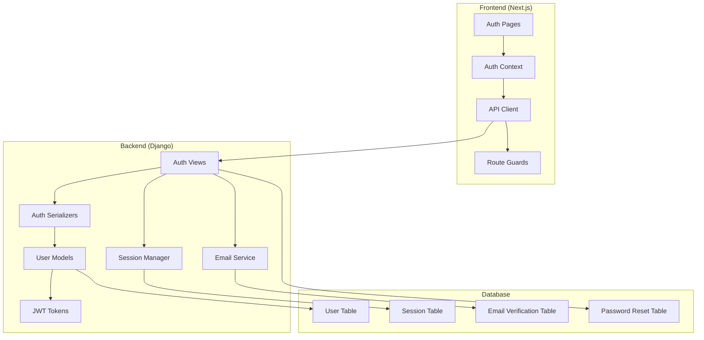

# Authentication System Fix - Design Document

## Overview

This design document outlines the comprehensive fix for the authentication system in the multi-vendor e-commerce platform. The solution addresses critical issues in user authentication, admin authentication, email verification, password management, session handling, and user management CRUD operations. The design ensures secure, scalable, and user-friendly authentication flows for all user types (customers, sellers, admins) while maintaining consistency between frontend and backend systems.

## Architecture

### High-Level Architecture



### Authentication Flow Architecture

The system implements a dual-authentication approach:
- **Regular Users**: JWT-based authentication with refresh tokens
- **Admin Users**: Enhanced JWT with additional security layers and session tracking

**Design Rationale**: Separating admin and regular user authentication provides enhanced security for administrative functions while maintaining performance for regular users.

## Components and Interfaces

### Backend Components

#### 1. Authentication Models

```python
# Enhanced User Model
class User(AbstractUser):
    email = models.EmailField(unique=True)
    user_type = models.CharField(choices=USER_TYPE_CHOICES)
    is_email_verified = models.BooleanField(default=False)
    phone_number = models.CharField(max_length=20, blank=True)
    created_at = models.DateTimeField(auto_now_add=True)
    updated_at = models.DateTimeField(auto_now=True)
    last_login_ip = models.GenericIPAddressField(null=True)
    failed_login_attempts = models.IntegerField(default=0)
    account_locked_until = models.DateTimeField(null=True)

# Email Verification Model
class EmailVerification:
    user = ForeignKey(User)
    token = CharField(unique=True)
    created_at = DateTimeField()
    expires_at = DateTimeField()
    is_used = BooleanField(default=False)

# Password Reset Model
class PasswordReset:
    user = ForeignKey(User)
    token = CharField(unique=True)
    created_at = DateTimeField()
    expires_at = DateTimeField()
    is_used = BooleanField(default=False)
    ip_address = GenericIPAddressField()

# Session Management Model
class UserSession:
    user = ForeignKey(User)
    session_key = CharField(unique=True)
    device_info = JSONField()
    ip_address = GenericIPAddressField()
    created_at = DateTimeField()
    last_activity = DateTimeField()
    is_active = BooleanField(default=True)
```

**Design Rationale**: Separate models for verification and reset tokens provide better security, audit trails, and prevent token reuse. Session tracking enables multi-device management.

#### 2. Authentication Services

```python
class AuthenticationService:
    def register_user(self, data) -> User
    def authenticate_user(self, email, password) -> dict
    def refresh_token(self, refresh_token) -> dict
    def logout_user(self, user, session_key=None) -> bool
    def logout_all_sessions(self, user) -> bool

class EmailVerificationService:
    def send_verification_email(self, user) -> bool
    def verify_email(self, token) -> bool
    def resend_verification(self, user) -> bool

class PasswordResetService:
    def request_password_reset(self, email) -> bool
    def validate_reset_token(self, token) -> bool
    def reset_password(self, token, new_password) -> bool

class SessionManagementService:
    def create_session(self, user, device_info) -> UserSession
    def get_user_sessions(self, user) -> QuerySet
    def terminate_session(self, session_key) -> bool
    def cleanup_expired_sessions() -> int
```

#### 3. API Endpoints Structure

```python
# Regular Authentication Endpoints
POST /api/v1/auth/register/
POST /api/v1/auth/login/
POST /api/v1/auth/logout/
POST /api/v1/auth/refresh/
POST /api/v1/auth/password-reset/request/
POST /api/v1/auth/password-reset/confirm/
GET  /api/v1/auth/verify-email/{token}/
POST /api/v1/auth/resend-verification/

# Admin Authentication Endpoints
POST /api/v1/admin-auth/login/
POST /api/v1/admin-auth/logout/
POST /api/v1/admin-auth/refresh/

# User Management Endpoints
GET    /api/v1/users/
POST   /api/v1/users/
GET    /api/v1/users/{id}/
PUT    /api/v1/users/{id}/
DELETE /api/v1/users/{id}/
GET    /api/v1/users/me/
PUT    /api/v1/users/me/
DELETE /api/v1/users/me/

# Session Management Endpoints
GET    /api/v1/users/me/sessions/
DELETE /api/v1/users/me/sessions/{session_id}/
DELETE /api/v1/users/me/sessions/all/
```

### Frontend Components

#### 1. Authentication Context

```typescript
interface AuthContextType {
  user: User | null;
  isAuthenticated: boolean;
  isLoading: boolean;
  login: (email: string, password: string) => Promise<void>;
  register: (userData: RegisterData) => Promise<void>;
  logout: () => Promise<void>;
  refreshToken: () => Promise<void>;
  updateUser: (userData: Partial<User>) => void;
}
```

#### 2. Route Protection Components

```typescript
// Higher-Order Component for route protection
const withAuth = (WrappedComponent: React.ComponentType, requiredRole?: UserRole) => {
  return function AuthenticatedComponent(props: any) {
    // Authentication and authorization logic
  };
};

// Route guard hook
const useRouteGuard = (requiredRole?: UserRole) => {
  // Route protection logic
};
```

#### 3. Form Components

```typescript
// Registration Form Component
interface RegisterFormProps {
  onSubmit: (data: RegisterData) => Promise<void>;
  userType: 'customer' | 'seller';
}

// Login Form Component
interface LoginFormProps {
  onSubmit: (email: string, password: string) => Promise<void>;
  isAdmin?: boolean;
}

// Password Reset Components
interface PasswordResetRequestProps {
  onSubmit: (email: string) => Promise<void>;
}

interface PasswordResetConfirmProps {
  token: string;
  onSubmit: (password: string) => Promise<void>;
}
```

## Data Models

### User Data Model

```typescript
interface User {
  id: number;
  username: string;
  email: string;
  firstName: string;
  lastName: string;
  userType: 'customer' | 'seller' | 'admin' | 'super_admin';
  isEmailVerified: boolean;
  phoneNumber?: string;
  isActive: boolean;
  dateJoined: string;
  lastLogin?: string;
  profileImage?: string;
}

interface RegisterData {
  username: string;
  email: string;
  password: string;
  confirmPassword: string;
  firstName: string;
  lastName: string;
  userType: 'customer' | 'seller';
  phoneNumber?: string;
}

interface LoginResponse {
  access: string;
  refresh: string;
  user: User;
  sessionId: string;
}
```

### Session Data Model

```typescript
interface UserSession {
  id: string;
  deviceInfo: {
    browser: string;
    os: string;
    device: string;
  };
  ipAddress: string;
  location?: string;
  createdAt: string;
  lastActivity: string;
  isActive: boolean;
  isCurrent: boolean;
}
```

### Verification Data Models

```typescript
interface EmailVerificationToken {
  token: string;
  expiresAt: string;
  isUsed: boolean;
}

interface PasswordResetToken {
  token: string;
  expiresAt: string;
  isUsed: boolean;
  ipAddress: string;
}
```

## Error Handling

### Backend Error Handling Strategy

```python
class AuthenticationError(Exception):
    """Base authentication error"""
    pass

class InvalidCredentialsError(AuthenticationError):
    """Invalid login credentials"""
    pass

class AccountLockedError(AuthenticationError):
    """Account temporarily locked"""
    pass

class EmailNotVerifiedError(AuthenticationError):
    """Email verification required"""
    pass

class TokenExpiredError(AuthenticationError):
    """Token has expired"""
    pass

# Error Response Format
{
    "error": {
        "code": "INVALID_CREDENTIALS",
        "message": "Invalid email or password",
        "details": {},
        "timestamp": "2025-01-14T10:30:00Z"
    }
}
```

**Design Rationale**: Structured error handling with specific error codes enables consistent frontend error handling and better user experience without exposing security details.

### Frontend Error Handling

```typescript
interface AuthError {
  code: string;
  message: string;
  field?: string;
  details?: Record<string, any>;
}

class AuthErrorHandler {
  static handleAuthError(error: AuthError): string {
    // Map backend error codes to user-friendly messages
  }
  
  static handleValidationErrors(errors: Record<string, string[]>): Record<string, string> {
    // Process field validation errors
  }
}
```

### Rate Limiting Strategy

- **Login attempts**: 5 attempts per IP per 15 minutes
- **Password reset**: 5 requests per email per hour
- **Email verification**: 3 requests per email per hour
- **Registration**: 10 attempts per IP per hour

**Design Rationale**: Progressive rate limiting prevents abuse while allowing legitimate users to recover from mistakes.

## Testing Strategy

### Backend Testing

```python
# Authentication Service Tests
class TestAuthenticationService:
    def test_user_registration_success()
    def test_user_registration_duplicate_email()
    def test_user_login_success()
    def test_user_login_invalid_credentials()
    def test_user_login_unverified_email()
    def test_password_reset_flow()
    def test_email_verification_flow()
    def test_session_management()

# API Endpoint Tests
class TestAuthenticationAPI:
    def test_register_endpoint()
    def test_login_endpoint()
    def test_logout_endpoint()
    def test_refresh_token_endpoint()
    def test_password_reset_endpoints()
    def test_email_verification_endpoints()

# Security Tests
class TestAuthenticationSecurity:
    def test_rate_limiting()
    def test_token_security()
    def test_session_security()
    def test_password_strength_validation()
```

### Frontend Testing

```typescript
// Component Tests
describe('AuthenticationComponents', () => {
  describe('LoginForm', () => {
    it('should validate form inputs');
    it('should handle login success');
    it('should handle login errors');
  });
  
  describe('RegisterForm', () => {
    it('should validate registration data');
    it('should handle registration success');
    it('should handle validation errors');
  });
});

// Integration Tests
describe('AuthenticationFlow', () => {
  it('should complete full registration flow');
  it('should complete email verification flow');
  it('should complete password reset flow');
  it('should handle session management');
});

// Route Protection Tests
describe('RouteGuards', () => {
  it('should redirect unauthenticated users');
  it('should allow authenticated users');
  it('should enforce role-based access');
});
```

### End-to-End Testing

```python
# E2E Test Scenarios
class TestAuthenticationE2E:
    def test_complete_user_registration_journey()
    def test_complete_login_logout_journey()
    def test_password_reset_journey()
    def test_email_verification_journey()
    def test_admin_authentication_journey()
    def test_session_management_journey()
    def test_user_account_management_journey()
```

## Security Considerations

### Password Security
- **Minimum Requirements**: 8 characters, uppercase, lowercase, number, special character
- **Hashing**: Django's PBKDF2 with SHA256 (default)
- **Storage**: Never store plain text passwords
- **Reset Tokens**: Cryptographically secure, single-use, time-limited

### JWT Token Security
- **Access Token**: Short-lived (15 minutes)
- **Refresh Token**: Longer-lived (7 days), stored securely
- **Token Rotation**: New refresh token on each refresh
- **Blacklisting**: Implement token blacklist for logout

### Session Security
- **Session Tracking**: Track device, IP, location
- **Concurrent Sessions**: Allow multiple sessions with management
- **Session Timeout**: Automatic cleanup of expired sessions
- **Suspicious Activity**: Flag and notify users of unusual login patterns

### Admin Security Enhancements
- **Separate Login Flow**: Dedicated admin authentication endpoints
- **Enhanced Logging**: Detailed audit logs for admin actions
- **Additional Verification**: Optional 2FA for admin accounts
- **Session Restrictions**: Shorter session timeouts for admin users

**Design Rationale**: Layered security approach provides defense in depth while maintaining usability for different user types.

## Performance Considerations

### Database Optimization
- **Indexing**: Email, username, session keys, token fields
- **Connection Pooling**: Efficient database connection management
- **Query Optimization**: Use select_related for user profile data

### Caching Strategy
- **User Sessions**: Cache active sessions in Redis
- **Rate Limiting**: Use Redis for rate limit counters
- **Token Blacklist**: Cache blacklisted tokens

### Frontend Performance
- **Code Splitting**: Lazy load authentication components
- **Token Management**: Efficient token refresh logic
- **State Management**: Optimized Redux store for auth state

## Integration Points

### Email Service Integration
```python
class EmailService:
    def send_verification_email(self, user, token)
    def send_password_reset_email(self, user, token)
    def send_login_notification(self, user, device_info)
    def send_security_alert(self, user, event_type)
```

### Frontend-Backend Integration
- **API Client**: Axios with interceptors for token management
- **Error Handling**: Consistent error response format
- **State Synchronization**: Real-time auth state updates
- **Route Protection**: Seamless redirect handling

### Third-Party Integrations
- **Email Provider**: SendGrid/AWS SES for email delivery
- **Analytics**: Track authentication events
- **Monitoring**: Log authentication failures and security events

This design provides a comprehensive, secure, and scalable authentication system that addresses all requirements while maintaining excellent user experience and system performance.