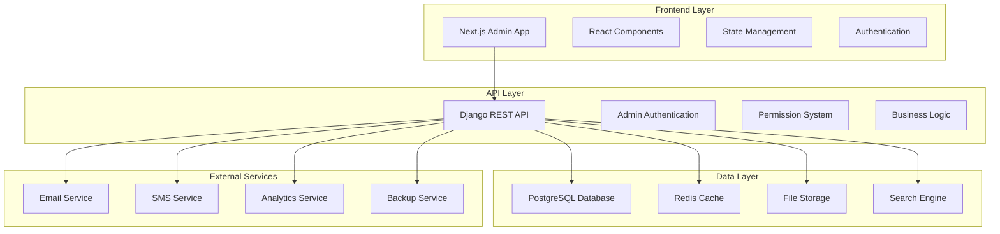

# Design Document

## Overview

The comprehensive admin panel will be built as a modern, responsive web application with a React/Next.js frontend and Django REST API backend. The system will feature a modular architecture with separate authentication, role-based access control, real-time analytics, and extensive CRUD operations for all business entities.

## Architecture

### High-Level Architecture



### System Components

#### Frontend Architecture
- **Framework**: Next.js 14 with App Router
- **UI Library**: Custom components with Tailwind CSS
- **State Management**: Redux Toolkit with RTK Query
- **Authentication**: JWT-based admin authentication
- **Charts**: Chart.js/Recharts for analytics
- **Forms**: React Hook Form with validation
- **Tables**: TanStack Table for data grids
- **File Upload**: Drag-and-drop with preview

#### Backend Architecture
- **Framework**: Django 4.2 with Django REST Framework
- **Authentication**: Custom admin user model with JWT
- **Permissions**: Role-based access control system
- **Database**: PostgreSQL with optimized indexes
- **Caching**: Redis for session and data caching
- **File Storage**: AWS S3 or local storage
- **Search**: PostgreSQL full-text search with optional Elasticsearch
- **Background Tasks**: Celery for report generation

## Components and Interfaces

### Frontend Components

#### 1. Authentication Components
```typescript
// AdminLogin.tsx
interface AdminLoginProps {
  onLogin: (credentials: AdminCredentials) => void;
  loading: boolean;
  error?: string;
}

// AdminAuthGuard.tsx
interface AdminAuthGuardProps {
  children: React.ReactNode;
  requiredPermissions?: string[];
  fallback?: React.ReactNode;
}
```

#### 2. Dashboard Components
```typescript
// AdminDashboard.tsx
interface DashboardStats {
  totalOrders: number;
  totalRevenue: number;
  totalCustomers: number;
  totalProducts: number;
  pendingOrders: number;
  lowStockProducts: number;
}

// DashboardWidget.tsx
interface WidgetProps {
  title: string;
  type: 'metric' | 'chart' | 'table' | 'list';
  data: any;
  config: WidgetConfig;
}
```

#### 3. CRUD Components
```typescript
// DataTable.tsx
interface DataTableProps<T> {
  data: T[];
  columns: ColumnDef<T>[];
  onEdit: (item: T) => void;
  onDelete: (id: string) => void;
  onBulkAction: (action: string, ids: string[]) => void;
  pagination: PaginationConfig;
  filters: FilterConfig[];
}

// FormModal.tsx
interface FormModalProps<T> {
  isOpen: boolean;
  onClose: () => void;
  onSubmit: (data: T) => void;
  initialData?: T;
  schema: ValidationSchema;
}
```

#### 4. Report Components
```typescript
// ReportBuilder.tsx
interface ReportBuilderProps {
  reportType: string;
  onGenerate: (config: ReportConfig) => void;
  availableFields: ReportField[];
  dateRange: DateRange;
}

// ChartComponent.tsx
interface ChartProps {
  type: 'line' | 'bar' | 'pie' | 'area';
  data: ChartData;
  options: ChartOptions;
}
```

### Backend API Endpoints

#### 1. Authentication Endpoints
```python
# /api/admin/auth/
POST /login/          # Admin login
POST /logout/         # Admin logout
POST /refresh/        # Refresh JWT token
GET  /profile/        # Get admin profile
PUT  /profile/        # Update admin profile
```

#### 2. Dashboard Endpoints
```python
# /api/admin/dashboard/
GET  /stats/          # Dashboard statistics
GET  /charts/         # Chart data
GET  /widgets/        # Dashboard widgets
POST /widgets/        # Create custom widget
```

#### 3. CRUD Endpoints (Pattern for all entities)
```python
# /api/admin/{entity}/
GET    /              # List with pagination/filtering
POST   /              # Create new record
GET    /{id}/         # Get specific record
PUT    /{id}/         # Update record
DELETE /{id}/         # Delete record
POST   /bulk/         # Bulk operations
GET    /export/       # Export data
POST   /import/       # Import data
```

#### 4. Report Endpoints
```python
# /api/admin/reports/
GET  /sales/          # Sales reports
GET  /inventory/      # Inventory reports
GET  /customers/      # Customer reports
GET  /financial/      # Financial reports
POST /generate/       # Generate custom report
GET  /scheduled/      # Scheduled reports
```

#### 5. Settings Endpoints
```python
# /api/admin/settings/
GET  /                # Get all settings
PUT  /                # Update settings
GET  /categories/     # Get setting categories
POST /backup/         # Create backup
GET  /logs/           # System logs
```

## Data Models

### Core Admin Models

#### AdminUser Model
```python
class AdminUser(AbstractUser):
    id = UUIDField(primary_key=True)
    role = CharField(choices=ADMIN_ROLES)
    phone = CharField(max_length=20)
    avatar = ImageField()
    department = CharField(max_length=100)
    permissions = ManyToManyField(AdminPermission)
    last_login_ip = GenericIPAddressField()
    created_at = DateTimeField(auto_now_add=True)
    updated_at = DateTimeField(auto_now=True)
```

#### SystemSettings Model
```python
class SystemSettings(Model):
    key = CharField(max_length=100, unique=True)
    value = TextField()
    setting_type = CharField(choices=SETTING_TYPES)
    category = CharField(max_length=50)
    description = TextField()
    is_public = BooleanField(default=False)
```

#### ActivityLog Model
```python
class ActivityLog(Model):
    admin_user = ForeignKey(AdminUser)
    action = CharField(choices=ACTION_TYPES)
    model_name = CharField(max_length=100)
    object_id = CharField(max_length=100)
    changes = JSONField()
    ip_address = GenericIPAddressField()
    timestamp = DateTimeField(auto_now_add=True)
```

### Business Entity Models

#### Enhanced Product Model
```python
class Product(Model):
    # Basic Information
    name = CharField(max_length=200)
    slug = SlugField(unique=True)
    description = TextField()
    short_description = TextField()
    
    # Categorization
    category = ForeignKey(Category)
    brand = ForeignKey(Brand)
    tags = ManyToManyField(Tag)
    
    # Pricing
    price = DecimalField(max_digits=10, decimal_places=2)
    cost_price = DecimalField(max_digits=10, decimal_places=2)
    discount_price = DecimalField(max_digits=10, decimal_places=2)
    
    # Inventory
    sku = CharField(max_length=100, unique=True)
    stock_quantity = IntegerField()
    low_stock_threshold = IntegerField()
    
    # Physical Properties
    weight = DecimalField(max_digits=8, decimal_places=2)
    dimensions = JSONField()  # length, width, height
    
    # SEO
    meta_title = CharField(max_length=200)
    meta_description = TextField()
    meta_keywords = CharField(max_length=500)
    
    # Status
    status = CharField(choices=PRODUCT_STATUS)
    is_featured = BooleanField(default=False)
    is_digital = BooleanField(default=False)
    
    # Timestamps
    created_at = DateTimeField(auto_now_add=True)
    updated_at = DateTimeField(auto_now=True)
```

#### Enhanced Order Model
```python
class Order(Model):
    # Order Information
    order_number = CharField(max_length=50, unique=True)
    customer = ForeignKey(Customer)
    status = CharField(choices=ORDER_STATUS)
    
    # Pricing
    subtotal = DecimalField(max_digits=10, decimal_places=2)
    tax_amount = DecimalField(max_digits=10, decimal_places=2)
    shipping_amount = DecimalField(max_digits=10, decimal_places=2)
    discount_amount = DecimalField(max_digits=10, decimal_places=2)
    total_amount = DecimalField(max_digits=10, decimal_places=2)
    
    # Addresses
    billing_address = JSONField()
    shipping_address = JSONField()
    
    # Payment
    payment_method = CharField(max_length=50)
    payment_status = CharField(choices=PAYMENT_STATUS)
    payment_reference = CharField(max_length=100)
    
    # Shipping
    shipping_method = CharField(max_length=50)
    tracking_number = CharField(max_length=100)
    
    # Timestamps
    created_at = DateTimeField(auto_now_add=True)
    updated_at = DateTimeField(auto_now=True)
    shipped_at = DateTimeField(null=True)
    delivered_at = DateTimeField(null=True)
```

## Error Handling

### Frontend Error Handling
```typescript
// Error boundary for React components
class AdminErrorBoundary extends Component {
  handleError(error: Error, errorInfo: ErrorInfo) {
    // Log error to monitoring service
    // Show user-friendly error message
    // Provide recovery options
  }
}

// API error handling
const handleApiError = (error: ApiError) => {
  switch (error.status) {
    case 401:
      // Redirect to login
      break;
    case 403:
      // Show permission denied message
      break;
    case 500:
      // Show server error message
      break;
    default:
      // Show generic error message
  }
};
```

### Backend Error Handling
```python
# Custom exception handler
def custom_exception_handler(exc, context):
    response = exception_handler(exc, context)
    
    if response is not None:
        custom_response_data = {
            'error': True,
            'message': str(exc),
            'status_code': response.status_code,
            'timestamp': timezone.now().isoformat(),
        }
        response.data = custom_response_data
    
    return response

# Activity logging for errors
class ActivityLogMiddleware:
    def process_exception(self, request, exception):
        if hasattr(request, 'user') and request.user.is_authenticated:
            ActivityLog.objects.create(
                admin_user=request.user,
                action='error',
                model_name='system',
                changes={'error': str(exception)},
                ip_address=get_client_ip(request)
            )
```

## Testing Strategy

### Frontend Testing
```typescript
// Component testing with React Testing Library
describe('AdminDashboard', () => {
  test('renders dashboard stats correctly', () => {
    render(<AdminDashboard />);
    expect(screen.getByText('Total Orders')).toBeInTheDocument();
  });
  
  test('handles permission-based rendering', () => {
    const user = { permissions: ['view_dashboard'] };
    render(<AdminDashboard user={user} />);
    // Assert correct components are rendered
  });
});

// Integration testing for API calls
describe('Admin API Integration', () => {
  test('fetches dashboard data successfully', async () => {
    const data = await adminApi.getDashboardStats();
    expect(data).toHaveProperty('totalOrders');
  });
});
```

### Backend Testing
```python
# Model testing
class AdminUserModelTest(TestCase):
    def test_admin_user_creation(self):
        user = AdminUser.objects.create_user(
            username='admin',
            email='admin@test.com',
            role='admin'
        )
        self.assertEqual(user.role, 'admin')
        self.assertTrue(user.is_active)

# API testing
class AdminAPITest(APITestCase):
    def setUp(self):
        self.admin_user = AdminUser.objects.create_user(
            username='admin',
            password='testpass'
        )
        self.client.force_authenticate(user=self.admin_user)
    
    def test_dashboard_stats_endpoint(self):
        response = self.client.get('/api/admin/dashboard/stats/')
        self.assertEqual(response.status_code, 200)
        self.assertIn('totalOrders', response.data)

# Permission testing
class PermissionTest(TestCase):
    def test_permission_required_decorator(self):
        # Test that views require proper permissions
        pass
```

### Database Testing
```python
# Performance testing
class DatabasePerformanceTest(TestCase):
    def test_dashboard_query_performance(self):
        # Create test data
        # Measure query execution time
        # Assert performance meets requirements
        pass
    
    def test_bulk_operations_performance(self):
        # Test bulk insert/update operations
        pass
```

## Security Considerations

### Authentication Security
- JWT tokens with short expiration times
- Refresh token rotation
- IP-based access restrictions
- Multi-factor authentication support
- Session management with Redis

### Authorization Security
- Role-based access control (RBAC)
- Permission-based function access
- API endpoint protection
- Resource-level permissions
- Audit logging for all actions

### Data Security
- Input validation and sanitization
- SQL injection prevention
- XSS protection
- CSRF protection
- Encrypted sensitive data storage
- Secure file upload handling

### Infrastructure Security
- HTTPS enforcement
- Security headers
- Rate limiting
- DDoS protection
- Regular security updates
- Vulnerability scanning