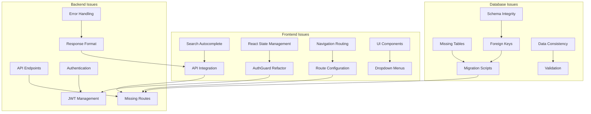

# Critical Frontend Fixes - Design Document

## Overview

This design addresses critical user-facing issues in the e-commerce platform by implementing systematic fixes across the frontend (Next.js), backend (Django REST API), and database (MySQL) layers. The solution focuses on immediate functionality restoration while maintaining code quality and following established patterns.

The design prioritizes quick resolution of blocking issues while ensuring proper error handling, state management, and database integrity. Each fix is designed to be independent yet cohesive with the overall system architecture.

## Architecture

### Problem Categories and Solutions



### Fix Priority Matrix

1. **Critical (Blocking)**: Database tables, authentication errors, cart functionality
2. **High (User Experience)**: Search, navigation, error messages
3. **Medium (Enhancement)**: Filters, dropdowns, wishlist

## Components and Interfaces

### 1. Search Autocomplete System

**Problem**: Search bar not showing dropdown suggestions
**Solution**: Implement debounced search with autocomplete API

**Frontend Component**:
```typescript
interface SearchSuggestion {
  id: string;
  type: 'product' | 'category';
  name: string;
  image?: string;
  url: string;
}

interface SearchAutocompleteProps {
  onSelect: (suggestion: SearchSuggestion) => void;
  placeholder?: string;
}

const SearchAutocomplete: React.FC<SearchAutocompleteProps> = ({
  onSelect,
  placeholder = "Search products and categories..."
}) => {
  const [query, setQuery] = useState('');
  const [suggestions, setSuggestions] = useState<SearchSuggestion[]>([]);
  const [isOpen, setIsOpen] = useState(false);
  
  // Debounced search implementation
  const debouncedSearch = useCallback(
    debounce(async (searchQuery: string) => {
      if (searchQuery.length >= 2) {
        const results = await searchAPI.getSuggestions(searchQuery);
        setSuggestions(results);
        setIsOpen(true);
      }
    }, 300),
    []
  );
  
  // Component implementation...
};
```

**Backend API**:
```python
class SearchSuggestionsView(APIView):
    def get(self, request):
        query = request.GET.get('q', '').strip()
        if len(query) < 2:
            return Response({'suggestions': []})
        
        # Search products
        products = Product.objects.filter(
            name__icontains=query,
            is_active=True
        )[:5]
        
        # Search categories
        categories = Category.objects.filter(
            name__icontains=query,
            is_active=True
        )[:3]
        
        suggestions = []
        
        for product in products:
            suggestions.append({
                'id': str(product.id),
                'type': 'product',
                'name': product.name,
                'image': product.image.url if product.image else None,
                'url': f'/products/{product.id}'
            })
        
        for category in categories:
            suggestions.append({
                'id': str(category.id),
                'type': 'category',
                'name': category.name,
                'url': f'/categories/{category.slug}'
            })
        
        return Response({'suggestions': suggestions})
```

### 2. Authentication State Management Fix

**Problem**: React rendering errors with AuthGuard component
**Solution**: Refactor to use proper React patterns with useEffect and state management

**AuthGuard Refactor**:
```typescript
interface AuthGuardProps {
  children: React.ReactNode;
  requireAuth?: boolean;
  redirectTo?: string;
}

const AuthGuard: React.FC<AuthGuardProps> = ({ 
  children, 
  requireAuth = true, 
  redirectTo = '/login' 
}) => {
  const [isLoading, setIsLoading] = useState(true);
  const [isAuthenticated, setIsAuthenticated] = useState(false);
  const router = useRouter();
  
  useEffect(() => {
    const checkAuth = async () => {
      try {
        const token = localStorage.getItem('authToken');
        if (!token) {
          setIsAuthenticated(false);
          setIsLoading(false);
          return;
        }
        
        // Validate token with backend
        const response = await authAPI.validateToken(token);
        setIsAuthenticated(response.valid);
      } catch (error) {
        console.error('Auth validation error:', error);
        setIsAuthenticated(false);
      } finally {
        setIsLoading(false);
      }
    };
    
    checkAuth();
  }, []);
  
  useEffect(() => {
    if (!isLoading && requireAuth && !isAuthenticated) {
      router.push(redirectTo);
    }
  }, [isLoading, isAuthenticated, requireAuth, redirectTo, router]);
  
  if (isLoading) {
    return <LoadingSpinner />;
  }
  
  if (requireAuth && !isAuthenticated) {
    return null; // Will redirect via useEffect
  }
  
  return <>{children}</>;
};
```

### 3. Database Schema Fixes

**Problem**: Missing cart_cart table and other database inconsistencies
**Solution**: Create comprehensive migration script

**Migration Strategy**:
```python
# Create missing tables migration
from django.db import migrations, models
import django.db.models.deletion

class Migration(migrations.Migration):
    dependencies = [
        ('cart', '0001_initial'),  # Adjust based on existing migrations
        ('products', '0001_initial'),
        ('authentication', '0001_initial'),
    ]

    operations = [
        # Cart table
        migrations.CreateModel(
            name='Cart',
            fields=[
                ('id', models.AutoField(primary_key=True)),
                ('user', models.ForeignKey(
                    'authentication.User',
                    on_delete=models.CASCADE,
                    related_name='carts'
                )),
                ('created_at', models.DateTimeField(auto_now_add=True)),
                ('updated_at', models.DateTimeField(auto_now=True)),
                ('is_active', models.BooleanField(default=True)),
            ],
            options={
                'db_table': 'cart_cart',
                'verbose_name': 'Cart',
                'verbose_name_plural': 'Carts',
            },
        ),
        
        # Cart items table
        migrations.CreateModel(
            name='CartItem',
            fields=[
                ('id', models.AutoField(primary_key=True)),
                ('cart', models.ForeignKey(
                    'cart.Cart',
                    on_delete=models.CASCADE,
                    related_name='items'
                )),
                ('product', models.ForeignKey(
                    'products.Product',
                    on_delete=models.CASCADE
                )),
                ('quantity', models.PositiveIntegerField(default=1)),
                ('created_at', models.DateTimeField(auto_now_add=True)),
                ('updated_at', models.DateTimeField(auto_now=True)),
            ],
            options={
                'db_table': 'cart_cartitem',
                'unique_together': [('cart', 'product')],
            },
        ),
        
        # Add indexes for performance
        migrations.RunSQL(
            "CREATE INDEX idx_cart_user_active ON cart_cart (user_id, is_active);",
            reverse_sql="DROP INDEX idx_cart_user_active ON cart_cart;"
        ),
        
        migrations.RunSQL(
            "CREATE INDEX idx_cartitem_cart ON cart_cartitem (cart_id);",
            reverse_sql="DROP INDEX idx_cartitem_cart ON cart_cartitem;"
        ),
    ]
```

### 4. Navigation and Routing Fixes

**Problem**: Category links showing 404 errors
**Solution**: Implement proper Next.js dynamic routing

**Route Structure**:
```typescript
// app/categories/[slug]/page.tsx
interface CategoryPageProps {
  params: {
    slug: string;
  };
  searchParams: {
    page?: string;
    sort?: string;
    filter?: string;
  };
}

export default async function CategoryPage({ 
  params, 
  searchParams 
}: CategoryPageProps) {
  const { slug } = params;
  const page = parseInt(searchParams.page || '1');
  
  try {
    const category = await categoryAPI.getBySlug(slug);
    const products = await productAPI.getByCategorySlug(slug, {
      page,
      sort: searchParams.sort,
      filter: searchParams.filter
    });
    
    return (
      <CategoryPageComponent 
        category={category}
        products={products}
        currentPage={page}
      />
    );
  } catch (error) {
    if (error.status === 404) {
      notFound();
    }
    throw error;
  }
}

// Generate static params for known categories
export async function generateStaticParams() {
  const categories = await categoryAPI.getAll();
  return categories.map((category) => ({
    slug: category.slug,
  }));
}
```

### 5. Error Handling and User Feedback

**Problem**: Generic error messages not showing specific API errors
**Solution**: Implement comprehensive error handling system

**Error Handler**:
```typescript
interface APIError {
  message: string;
  field?: string;
  code?: string;
}

class ErrorHandler {
  static parseAPIError(error: any): string {
    // Handle different error response formats
    if (error.response?.data) {
      const data = error.response.data;
      
      // Django REST Framework error format
      if (data.detail) {
        return data.detail;
      }
      
      // Field-specific errors
      if (data.email && Array.isArray(data.email)) {
        return data.email[0];
      }
      
      // Generic error message
      if (data.message) {
        return data.message;
      }
      
      // Non-field errors
      if (data.non_field_errors && Array.isArray(data.non_field_errors)) {
        return data.non_field_errors[0];
      }
    }
    
    // Network errors
    if (error.code === 'NETWORK_ERROR') {
      return 'Network connection error. Please check your internet connection.';
    }
    
    // Default fallback
    return 'An unexpected error occurred. Please try again.';
  }
  
  static showToast(error: any, type: 'error' | 'success' | 'warning' = 'error') {
    const message = this.parseAPIError(error);
    toast[type](message);
  }
}
```

### 6. Cart Functionality Implementation

**Problem**: Cart operations failing due to missing backend implementation
**Solution**: Complete cart API and frontend integration

**Cart API Views**:
```python
class CartViewSet(viewsets.ModelViewSet):
    serializer_class = CartSerializer
    permission_classes = [IsAuthenticated]
    
    def get_queryset(self):
        return Cart.objects.filter(
            user=self.request.user,
            is_active=True
        ).prefetch_related('items__product')
    
    def get_or_create_cart(self):
        cart, created = Cart.objects.get_or_create(
            user=self.request.user,
            is_active=True,
            defaults={'created_at': timezone.now()}
        )
        return cart
    
    @action(detail=False, methods=['post'])
    def add_item(self, request):
        cart = self.get_or_create_cart()
        product_id = request.data.get('product_id')
        quantity = int(request.data.get('quantity', 1))
        
        try:
            product = Product.objects.get(id=product_id, is_active=True)
        except Product.DoesNotExist:
            return Response(
                {'error': 'Product not found'}, 
                status=status.HTTP_404_NOT_FOUND
            )
        
        cart_item, created = CartItem.objects.get_or_create(
            cart=cart,
            product=product,
            defaults={'quantity': quantity}
        )
        
        if not created:
            cart_item.quantity += quantity
            cart_item.save()
        
        serializer = CartSerializer(cart)
        return Response(serializer.data, status=status.HTTP_200_OK)
    
    @action(detail=False, methods=['delete'])
    def remove_item(self, request):
        cart = self.get_or_create_cart()
        product_id = request.data.get('product_id')
        
        try:
            cart_item = CartItem.objects.get(
                cart=cart,
                product_id=product_id
            )
            cart_item.delete()
            
            serializer = CartSerializer(cart)
            return Response(serializer.data, status=status.HTTP_200_OK)
        except CartItem.DoesNotExist:
            return Response(
                {'error': 'Item not found in cart'}, 
                status=status.HTTP_404_NOT_FOUND
            )
```

## Data Models

### Updated Cart Models

```python
class Cart(models.Model):
    user = models.ForeignKey(
        'authentication.User',
        on_delete=models.CASCADE,
        related_name='carts'
    )
    created_at = models.DateTimeField(auto_now_add=True)
    updated_at = models.DateTimeField(auto_now=True)
    is_active = models.BooleanField(default=True)
    
    class Meta:
        db_table = 'cart_cart'
        verbose_name = 'Cart'
        verbose_name_plural = 'Carts'
        indexes = [
            models.Index(fields=['user', 'is_active']),
        ]
    
    def get_total_items(self):
        return self.items.aggregate(
            total=models.Sum('quantity')
        )['total'] or 0
    
    def get_total_price(self):
        return sum(item.get_total_price() for item in self.items.all())

class CartItem(models.Model):
    cart = models.ForeignKey(
        Cart,
        on_delete=models.CASCADE,
        related_name='items'
    )
    product = models.ForeignKey(
        'products.Product',
        on_delete=models.CASCADE
    )
    quantity = models.PositiveIntegerField(default=1)
    created_at = models.DateTimeField(auto_now_add=True)
    updated_at = models.DateTimeField(auto_now=True)
    
    class Meta:
        db_table = 'cart_cartitem'
        unique_together = [('cart', 'product')]
        indexes = [
            models.Index(fields=['cart']),
            models.Index(fields=['product']),
        ]
    
    def get_total_price(self):
        return self.product.price * self.quantity
```

## Error Handling

### Comprehensive Error Management Strategy

1. **Frontend Error Boundaries**:
   - Catch React rendering errors
   - Provide fallback UI components
   - Log errors for debugging

2. **API Error Handling**:
   - Standardize error response format
   - Implement retry logic for network failures
   - Provide meaningful user feedback

3. **Database Error Recovery**:
   - Handle connection failures gracefully
   - Implement transaction rollbacks
   - Provide data consistency checks

```typescript
class ErrorBoundary extends React.Component<
  { children: React.ReactNode },
  { hasError: boolean; error?: Error }
> {
  constructor(props: { children: React.ReactNode }) {
    super(props);
    this.state = { hasError: false };
  }
  
  static getDerivedStateFromError(error: Error) {
    return { hasError: true, error };
  }
  
  componentDidCatch(error: Error, errorInfo: React.ErrorInfo) {
    console.error('Error boundary caught error:', error, errorInfo);
    // Log to error reporting service
  }
  
  render() {
    if (this.state.hasError) {
      return (
        <div className="error-fallback">
          <h2>Something went wrong</h2>
          <p>We're sorry, but something unexpected happened.</p>
          <button onClick={() => window.location.reload()}>
            Refresh Page
          </button>
        </div>
      );
    }
    
    return this.props.children;
  }
}
```

## Testing Strategy

### Fix Validation Tests

1. **Search Functionality Tests**:
   - Test autocomplete API responses
   - Validate dropdown behavior
   - Test keyboard navigation

2. **Authentication Tests**:
   - Test AuthGuard component behavior
   - Validate token handling
   - Test redirect functionality

3. **Navigation Tests**:
   - Test all route configurations
   - Validate dynamic routing
   - Test 404 error handling

4. **Cart Functionality Tests**:
   - Test add/remove operations
   - Validate database transactions
   - Test error scenarios

```typescript
// Example test for search autocomplete
describe('SearchAutocomplete', () => {
  it('should show suggestions when typing', async () => {
    const mockSuggestions = [
      { id: '1', type: 'product', name: 'Test Product', url: '/products/1' }
    ];
    
    jest.spyOn(searchAPI, 'getSuggestions').mockResolvedValue(mockSuggestions);
    
    render(<SearchAutocomplete onSelect={jest.fn()} />);
    
    const input = screen.getByPlaceholderText(/search/i);
    fireEvent.change(input, { target: { value: 'test' } });
    
    await waitFor(() => {
      expect(screen.getByText('Test Product')).toBeInTheDocument();
    });
  });
});
```

This design provides a comprehensive approach to fixing all critical issues while maintaining system integrity and following best practices for React, Django, and MySQL integration.