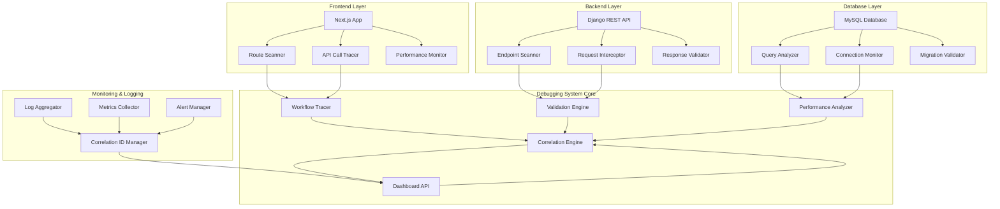

# E2E Workflow Debugging System - Design Document

## Overview

The E2E Workflow Debugging System is a comprehensive debugging and validation platform designed to ensure seamless integration between the Next.js frontend, Django REST API backend, and MySQL database. The system provides automated discovery, validation, tracing, and monitoring capabilities to identify and resolve integration issues across the entire technology stack.

The system operates as both a development tool and runtime monitoring solution, offering real-time insights into system behavior, performance metrics, and error tracking with correlation across all layers of the application.

## Architecture

### High-Level Architecture



### Component Architecture

The system follows a modular architecture with the following core components:

1. **Discovery Layer**: Automatically scans and maps frontend routes, API endpoints, and database schemas
2. **Validation Layer**: Tests and validates API endpoints, request/response formats, and data integrity
3. **Tracing Layer**: Tracks requests across all system layers with correlation IDs
4. **Monitoring Layer**: Collects performance metrics and system health data
5. **Dashboard Layer**: Provides interactive visualization and debugging tools

## Components and Interfaces

### 1. Frontend Route Discovery Service

**Purpose**: Automatically discover and map all Next.js routes and API calls

**Key Components**:
- `RouteScanner`: Analyzes Next.js app directory structure and dynamic routes
- `APICallExtractor`: Parses React components to identify fetch/axios calls
- `DependencyMapper`: Maps frontend routes to backend API endpoints

**Interfaces**:
```typescript
interface RouteInfo {
  path: string;
  type: 'page' | 'api' | 'dynamic';
  component: string;
  apiCalls: APICall[];
  dependencies: string[];
}

interface APICall {
  method: 'GET' | 'POST' | 'PUT' | 'DELETE' | 'PATCH';
  endpoint: string;
  payload?: object;
  headers?: Record<string, string>;
  authentication: boolean;
}
```

### 2. Backend API Validation Service

**Purpose**: Validate Django REST API endpoints and their configurations

**Key Components**:
- `EndpointScanner`: Discovers all Django URL patterns and view classes
- `SerializerAnalyzer`: Extracts serializer schemas and validation rules
- `AuthenticationValidator`: Tests JWT and session authentication flows
- `PermissionChecker`: Validates user permissions and access controls

**Interfaces**:
```python
@dataclass
class EndpointInfo:
    url_pattern: str
    view_class: str
    http_methods: List[str]
    serializer_class: Optional[str]
    authentication_classes: List[str]
    permission_classes: List[str]
    throttle_classes: List[str]

@dataclass
class ValidationResult:
    endpoint: str
    status: str  # 'pass', 'fail', 'warning'
    response_time: float
    status_code: int
    errors: List[str]
    warnings: List[str]
```

### 3. Database Connection and Query Monitor

**Purpose**: Monitor database connectivity, query performance, and data integrity

**Key Components**:
- `ConnectionPoolMonitor`: Tracks MySQL connection pool status and health
- `QueryAnalyzer`: Identifies slow queries and optimization opportunities
- `MigrationValidator`: Ensures database schema consistency
- `IntegrityChecker`: Validates foreign key relationships and constraints

**Interfaces**:
```python
@dataclass
class DatabaseHealth:
    connection_status: str
    active_connections: int
    max_connections: int
    slow_queries: List[SlowQuery]
    migration_status: str
    integrity_issues: List[str]

@dataclass
class SlowQuery:
    query: str
    execution_time: float
    frequency: int
    optimization_suggestions: List[str]
```

### 4. Workflow Tracing Engine

**Purpose**: Trace complete user workflows across all system layers

**Key Components**:
- `CorrelationManager`: Generates and manages correlation IDs for request tracking
- `WorkflowTracer`: Tracks request flow through frontend → API → database
- `TimingAnalyzer`: Measures response times at each layer
- `ErrorTracker`: Captures and correlates errors across the stack

**Interfaces**:
```python
@dataclass
class WorkflowTrace:
    correlation_id: str
    workflow_type: str  # 'login', 'product_fetch', 'cart_update', etc.
    start_time: datetime
    end_time: Optional[datetime]
    steps: List[TraceStep]
    status: str  # 'in_progress', 'completed', 'failed'
    errors: List[TraceError]

@dataclass
class TraceStep:
    layer: str  # 'frontend', 'api', 'database'
    component: str
    start_time: datetime
    end_time: Optional[datetime]
    status: str
    metadata: Dict[str, Any]
```

### 5. Performance Monitoring Service

**Purpose**: Monitor system performance and provide optimization recommendations

**Key Components**:
- `MetricsCollector`: Gathers performance metrics from all system layers
- `ThresholdManager`: Manages performance thresholds and alerting rules
- `OptimizationEngine`: Analyzes performance data and suggests improvements
- `TrendAnalyzer`: Tracks performance trends over time

**Interfaces**:
```python
@dataclass
class PerformanceMetrics:
    timestamp: datetime
    frontend_metrics: FrontendMetrics
    backend_metrics: BackendMetrics
    database_metrics: DatabaseMetrics
    overall_health_score: float

@dataclass
class OptimizationRecommendation:
    category: str  # 'database', 'api', 'frontend'
    priority: str  # 'high', 'medium', 'low'
    description: str
    implementation_steps: List[str]
    expected_improvement: str
```

### 6. Interactive Dashboard Service

**Purpose**: Provide web-based interface for debugging and monitoring

**Key Components**:
- `DashboardAPI`: REST API for dashboard data and operations
- `RealtimeUpdater`: WebSocket service for real-time dashboard updates
- `ReportGenerator`: Generates debugging reports and summaries
- `TestRunner`: Allows manual testing of API endpoints from dashboard

**Interfaces**:
```typescript
interface DashboardData {
  systemHealth: SystemHealth;
  activeTraces: WorkflowTrace[];
  recentErrors: TraceError[];
  performanceMetrics: PerformanceMetrics;
  optimizationRecommendations: OptimizationRecommendation[];
}

interface TestRequest {
  endpoint: string;
  method: string;
  payload?: object;
  headers?: Record<string, string>;
  expectedStatus?: number;
}
```

## Data Models

### Core Data Models

```python
# Workflow tracking models
class WorkflowSession(models.Model):
    correlation_id = models.UUIDField(unique=True)
    workflow_type = models.CharField(max_length=50)
    user_id = models.IntegerField(null=True, blank=True)
    start_time = models.DateTimeField(auto_now_add=True)
    end_time = models.DateTimeField(null=True, blank=True)
    status = models.CharField(max_length=20)
    metadata = models.JSONField(default=dict)

class TraceStep(models.Model):
    workflow_session = models.ForeignKey(WorkflowSession, on_delete=models.CASCADE)
    layer = models.CharField(max_length=20)
    component = models.CharField(max_length=100)
    start_time = models.DateTimeField()
    end_time = models.DateTimeField(null=True, blank=True)
    status = models.CharField(max_length=20)
    metadata = models.JSONField(default=dict)

# Performance monitoring models
class PerformanceSnapshot(models.Model):
    timestamp = models.DateTimeField(auto_now_add=True)
    layer = models.CharField(max_length=20)
    component = models.CharField(max_length=100)
    metric_name = models.CharField(max_length=50)
    metric_value = models.FloatField()
    metadata = models.JSONField(default=dict)

# Error tracking models
class ErrorLog(models.Model):
    correlation_id = models.UUIDField(null=True, blank=True)
    timestamp = models.DateTimeField(auto_now_add=True)
    layer = models.CharField(max_length=20)
    component = models.CharField(max_length=100)
    error_type = models.CharField(max_length=100)
    error_message = models.TextField()
    stack_trace = models.TextField(null=True, blank=True)
    metadata = models.JSONField(default=dict)
```

### Configuration Models

```python
class DebugConfiguration(models.Model):
    name = models.CharField(max_length=100, unique=True)
    enabled = models.BooleanField(default=True)
    config_data = models.JSONField()
    created_at = models.DateTimeField(auto_now_add=True)
    updated_at = models.DateTimeField(auto_now=True)

class PerformanceThreshold(models.Model):
    metric_name = models.CharField(max_length=100)
    layer = models.CharField(max_length=20)
    warning_threshold = models.FloatField()
    critical_threshold = models.FloatField()
    enabled = models.BooleanField(default=True)
```

## Error Handling

### Error Classification System

The system implements a comprehensive error classification and handling strategy:

1. **Frontend Errors**:
   - Network connectivity issues
   - API response parsing errors
   - Component rendering failures
   - Authentication token expiration

2. **Backend Errors**:
   - API endpoint failures
   - Serialization/deserialization errors
   - Authentication and authorization failures
   - Database connection issues

3. **Database Errors**:
   - Query execution failures
   - Connection pool exhaustion
   - Migration inconsistencies
   - Data integrity violations

### Error Recovery Strategies

```python
class ErrorHandler:
    def handle_frontend_error(self, error: FrontendError) -> ErrorResponse:
        """Handle frontend-specific errors with appropriate recovery actions"""
        if error.type == 'network_timeout':
            return self.retry_with_backoff(error.request)
        elif error.type == 'auth_token_expired':
            return self.refresh_token_and_retry(error.request)
        else:
            return self.log_and_escalate(error)
    
    def handle_backend_error(self, error: BackendError) -> ErrorResponse:
        """Handle backend-specific errors with circuit breaker pattern"""
        if self.circuit_breaker.is_open(error.component):
            return self.fallback_response(error)
        else:
            return self.process_with_monitoring(error)
    
    def handle_database_error(self, error: DatabaseError) -> ErrorResponse:
        """Handle database errors with connection pool management"""
        if error.type == 'connection_exhausted':
            return self.scale_connection_pool()
        elif error.type == 'slow_query':
            return self.optimize_query_and_retry(error.query)
        else:
            return self.failover_to_replica(error)
```

## Testing Strategy

### Automated Testing Framework

The system includes comprehensive automated testing across all layers:

1. **Unit Tests**:
   - Individual component functionality
   - Data model validation
   - Utility function testing
   - Error handling scenarios

2. **Integration Tests**:
   - API endpoint validation
   - Database connectivity testing
   - Frontend-backend communication
   - Authentication flow testing

3. **End-to-End Tests**:
   - Complete workflow validation
   - Performance benchmarking
   - Error recovery testing
   - Cross-browser compatibility

### Test Implementation Strategy

```python
class E2ETestSuite:
    def test_user_login_workflow(self):
        """Test complete user login workflow with tracing"""
        correlation_id = self.start_workflow_trace('user_login')
        
        # Frontend: Submit login form
        frontend_response = self.simulate_frontend_login()
        self.assert_frontend_success(frontend_response)
        
        # Backend: Process authentication
        backend_response = self.validate_backend_auth()
        self.assert_backend_success(backend_response)
        
        # Database: Verify user lookup
        db_response = self.validate_database_query()
        self.assert_database_success(db_response)
        
        # Validate complete workflow
        workflow_trace = self.get_workflow_trace(correlation_id)
        self.assert_workflow_complete(workflow_trace)
    
    def test_performance_thresholds(self):
        """Test that all components meet performance requirements"""
        metrics = self.collect_performance_metrics()
        
        self.assert_response_time_under_threshold(
            metrics.api_response_time, 200  # 200ms threshold
        )
        self.assert_database_query_time_under_threshold(
            metrics.db_query_time, 50  # 50ms threshold
        )
        self.assert_frontend_render_time_under_threshold(
            metrics.frontend_render_time, 100  # 100ms threshold
        )
```

### Continuous Monitoring Tests

```python
class ContinuousMonitoringTests:
    def test_system_health_checks(self):
        """Continuously monitor system health indicators"""
        health_check = self.run_health_check()
        
        self.assert_all_services_healthy(health_check.services)
        self.assert_database_connections_available(health_check.database)
        self.assert_no_critical_errors(health_check.error_log)
    
    def test_performance_regression(self):
        """Detect performance regressions over time"""
        current_metrics = self.collect_current_metrics()
        historical_baseline = self.get_performance_baseline()
        
        regression_analysis = self.analyze_performance_regression(
            current_metrics, historical_baseline
        )
        
        self.assert_no_significant_regression(regression_analysis)
```

This design provides a comprehensive foundation for implementing the E2E Workflow Debugging System with clear component boundaries, well-defined interfaces, and robust error handling and testing strategies.