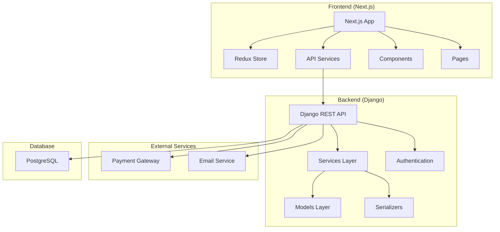
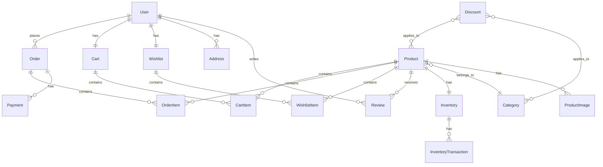

# E-Commerce Platform Design Document

## Overview

This document outlines the technical design for a comprehensive multi-vendor e-commerce platform built with Next.js/TypeScript frontend and Django REST Framework backend. The system follows clean architecture principles, SOLID design patterns, and implements a fully dynamic, scalable solution with advanced cart management, order processing, payment systems, shipping logistics, inventory management, customer management, seller panel, and comprehensive admin analytics - all with zero static data.

## Architecture

### High-Level Architecture



### Project Structure

```
ecommerce-platform/
├── frontend/                    # Next.js Frontend
│   ├── src/
│   │   ├── components/         # Reusable UI components
│   │   │   ├── common/        # Common components (Header, Footer, etc.)
│   │   │   ├── product/       # Product-related components
│   │   │   ├── cart/          # Enhanced cart components (save for later, coupons)
│   │   │   ├── checkout/      # Checkout and payment components
│   │   │   ├── orders/        # Order tracking, returns, invoices
│   │   │   ├── auth/          # Authentication components
│   │   │   ├── admin/         # Admin panel components
│   │   │   ├── seller/        # Seller panel components
│   │   │   ├── shipping/      # Shipping and logistics components
│   │   │   ├── analytics/     # Analytics and dashboard components
│   │   │   ├── search/        # Search and filtering components
│   │   │   ├── notifications/ # Notification components
│   │   │   └── chat/          # Real-time chat components
│   │   ├── pages/             # Next.js pages
│   │   │   ├── api/           # API routes (if needed)
│   │   │   ├── auth/          # Authentication pages
│   │   │   ├── products/      # Product pages
│   │   │   ├── cart/          # Cart and checkout pages
│   │   │   ├── orders/        # Order management pages
│   │   │   ├── admin/         # Admin panel pages
│   │   │   ├── seller/        # Seller panel pages
│   │   │   └── user/          # User profile pages
│   │   ├── layouts/           # Layout components
│   │   │   ├── MainLayout.tsx # Main site layout
│   │   │   ├── AdminLayout.tsx# Admin panel layout
│   │   │   ├── SellerLayout.tsx# Seller panel layout
│   │   │   └── AuthLayout.tsx # Authentication layout
│   │   ├── store/             # Redux store configuration
│   │   │   ├── slices/        # Redux slices
│   │   │   ├── api/           # RTK Query API slices
│   │   │   └── middleware/    # Custom Redux middleware
│   │   ├── services/          # API service functions
│   │   ├── types/             # TypeScript type definitions
│   │   ├── utils/             # Utility functions
│   │   ├── hooks/             # Custom React hooks
│   │   ├── context/           # React Context providers
│   │   ├── constants/         # Centralized constants and enums
│   │   ├── middleware/        # Auth guards, route protections
│   │   ├── websocket/         # WebSocket connection management
│   │   └── styles/            # CSS/SCSS files
│   ├── public/                # Static assets
│   ├── package.json
│   ├── next.config.js
│   └── tsconfig.json
│
├── backend/                     # Django Backend
│   ├── ecommerce_project/      # Django project settings
│   │   ├── settings/          # Environment-specific settings
│   │   │   ├── base.py        # Base settings
│   │   │   ├── development.py # Development settings
│   │   │   ├── production.py  # Production settings
│   │   │   └── testing.py     # Testing settings
│   │   ├── urls.py
│   │   ├── wsgi.py
│   │   ├── asgi.py            # ASGI for WebSocket support
│   │   └── celery.py          # Celery configuration
│   ├── api/                   # Versioned API structure
│   │   ├── v1/                # API Version 1
│   │   │   ├── urls.py        # V1 URL routing
│   │   │   └── views/         # V1 API views
│   │   └── v2/                # API Version 2 (future)
│   ├── apps/                  # Django applications
│   │   ├── authentication/    # User authentication
│   │   │   ├── models.py
│   │   │   ├── serializers.py
│   │   │   ├── views.py
│   │   │   ├── services.py
│   │   │   └── signals.py
│   │   ├── products/          # Product management
│   │   │   ├── models.py
│   │   │   ├── serializers.py
│   │   │   ├── views.py
│   │   │   ├── services.py
│   │   │   └── signals.py
│   │   ├── orders/            # Advanced order management
│   │   │   ├── models.py      # Order, OrderItem, OrderTracking, Returns
│   │   │   ├── serializers.py
│   │   │   ├── views.py
│   │   │   ├── services.py    # Order processing, returns, replacements
│   │   │   └── signals.py
│   │   ├── cart/              # Enhanced shopping cart
│   │   │   ├── models.py      # Cart, CartItem, SavedItems, Coupons
│   │   │   ├── serializers.py
│   │   │   ├── views.py
│   │   │   ├── services.py    # Cart management, coupon validation
│   │   │   └── signals.py
│   │   ├── inventory/         # Comprehensive inventory management
│   │   │   ├── models.py
│   │   │   ├── serializers.py
│   │   │   ├── views.py
│   │   │   ├── services.py
│   │   │   └── signals.py
│   │   ├── customers/         # Customer management
│   │   │   ├── models.py
│   │   │   ├── serializers.py
│   │   │   ├── views.py
│   │   │   ├── services.py
│   │   │   └── signals.py
│   │   ├── payments/          # Advanced payment processing
│   │   │   ├── models.py      # Payment, Wallet, GiftCard, Refund
│   │   │   ├── serializers.py
│   │   │   ├── views.py
│   │   │   ├── services.py    # Payment gateway integration
│   │   │   └── signals.py
│   │   ├── shipping/          # Shipping and logistics
│   │   │   ├── models.py      # ShippingPartner, DeliverySlot, Tracking
│   │   │   ├── serializers.py
│   │   │   ├── views.py
│   │   │   ├── services.py    # Logistics integration
│   │   │   └── signals.py
│   │   ├── sellers/           # Multi-vendor seller management
│   │   │   ├── models.py      # Seller, SellerProfile, Commission, KYC
│   │   │   ├── serializers.py
│   │   │   ├── views.py
│   │   │   ├── services.py    # Seller operations, payouts, verification
│   │   │   └── signals.py
│   │   ├── analytics/         # Analytics and reporting
│   │   │   ├── models.py      # Analytics data models
│   │   │   ├── serializers.py
│   │   │   ├── views.py
│   │   │   ├── services.py    # Analytics processing
│   │   │   └── signals.py
│   │   ├── content/           # Content management (banners, carousels)
│   │   │   ├── models.py      # Banner, Carousel, Content
│   │   │   ├── serializers.py
│   │   │   ├── views.py
│   │   │   ├── services.py
│   │   │   └── signals.py
│   │   ├── reviews/           # Product reviews
│   │   │   ├── models.py
│   │   │   ├── serializers.py
│   │   │   ├── views.py
│   │   │   ├── services.py
│   │   │   └── signals.py
│   │   ├── search/            # Advanced search and filtering
│   │   │   ├── models.py      # Search analytics, suggestions
│   │   │   ├── serializers.py
│   │   │   ├── views.py
│   │   │   ├── services.py    # Elasticsearch integration
│   │   │   ├── documents.py   # Elasticsearch documents
│   │   │   └── signals.py
│   │   ├── notifications/     # Comprehensive notification system
│   │   │   ├── models.py      # Notification, NotificationPreference
│   │   │   ├── serializers.py
│   │   │   ├── views.py
│   │   │   ├── services.py    # Email, SMS, push notification services
│   │   │   └── signals.py
│   │   └── chat/              # Real-time chat and support
│   │       ├── models.py      # ChatRoom, Message
│   │       ├── serializers.py
│   │       ├── views.py
│   │       ├── consumers.py   # WebSocket consumers
│   │       └── routing.py     # WebSocket routing
│   ├── tasks/                 # Background task processing
│   │   ├── celery.py          # Celery configuration
│   │   ├── tasks.py           # Background job definitions
│   │   └── schedules.py       # Periodic task schedules
│   ├── core/                  # Shared utilities
│   │   ├── permissions.py
│   │   ├── pagination.py
│   │   ├── exceptions.py
│   │   ├── utils.py
│   │   ├── middleware.py      # Custom middleware
│   │   ├── validators.py      # Custom validators
│   │   └── integrations/      # External service integrations
│   │       ├── payment_gateways/
│   │       │   ├── razorpay.py
│   │       │   ├── stripe.py
│   │       │   └── base.py
│   │       ├── shipping_partners/
│   │       │   ├── shiprocket.py
│   │       │   ├── delhivery.py
│   │       │   └── base.py
│   │       ├── email_services/
│   │       │   ├── sendgrid.py
│   │       │   └── ses.py
│   │       └── search_engines/
│   │           └── elasticsearch.py
│   ├── logs/                  # Logging and monitoring
│   │   ├── handlers.py        # Custom logging handlers
│   │   ├── formatters.py      # Log formatters
│   │   └── filters.py         # Log filters
│   ├── requirements/          # Environment-specific requirements
│   │   ├── base.txt           # Base requirements
│   │   ├── development.txt    # Development requirements
│   │   └── production.txt     # Production requirements
│   └── manage.py
│
└── docs/                       # Documentation
    ├── api/                   # API documentation
    └── deployment/            # Deployment guides
```

## Components and Interfaces

### Frontend Components Architecture

#### Core Components Structure
```typescript
// Component hierarchy following Flipkart-like design
interface ComponentStructure {
  Layout: {
    Header: {
      Navigation: Component;
      SearchBar: Component;
      UserMenu: Component;
      CartIcon: Component;
    };
    Footer: Component;
    Sidebar: Component;
  };
  
  Product: {
    ProductCard: Component;
    ProductGrid: Component;
    ProductDetails: Component;
    ProductImages: Component;
    ProductReviews: Component;
  };
  
  Cart: {
    CartItem: Component;
    CartSummary: Component;
    CheckoutForm: Component;
  };
  
  Admin: {
    Dashboard: Component;
    ProductManagement: Component;
    InventoryManagement: Component;
    CustomerManagement: Component;
    OrderManagement: Component;
  };
}
```

#### Redux Store Structure
```typescript
interface RootState {
  auth: {
    user: User | null;
    token: string | null;
    isAuthenticated: boolean;
    loading: boolean;
  };
  
  products: {
    items: Product[];
    categories: Category[];
    filters: ProductFilters;
    pagination: PaginationState;
    loading: boolean;
  };
  
  cart: {
    items: CartItem[];
    savedItems: SavedItem[];
    coupons: AppliedCoupon[];
    total: number;
    discountAmount: number;
    loading: boolean;
  };
  
  orders: {
    items: Order[];
    currentOrder: Order | null;
    tracking: OrderTracking[];
    returns: ReturnRequest[];
    loading: boolean;
  };
  
  payments: {
    methods: PaymentMethod[];
    walletBalance: number;
    giftCards: GiftCard[];
    transactions: PaymentTransaction[];
    loading: boolean;
  };
  
  shipping: {
    partners: ShippingPartner[];
    deliverySlots: DeliverySlot[];
    trackingInfo: TrackingInfo[];
    loading: boolean;
  };
  
  admin: {
    inventory: InventoryState;
    customers: CustomerState;
    dashboard: DashboardState;
    analytics: AnalyticsState;
    content: ContentState;
  };
  
  seller: {
    profile: SellerProfile | null;
    products: SellerProduct[];
    orders: SellerOrder[];
    analytics: SellerAnalytics;
    payouts: PayoutHistory[];
    loading: boolean;
  };
}
```

### Backend Services Architecture

#### Service Layer Pattern
```python
# Base service class
class BaseService:
    def __init__(self, model_class):
        self.model_class = model_class
    
    def create(self, validated_data):
        pass
    
    def update(self, instance, validated_data):
        pass
    
    def delete(self, instance):
        pass

# Example: Product Service
class ProductService(BaseService):
    def __init__(self):
        super().__init__(Product)
    
    def create_product_with_inventory(self, product_data, inventory_data):
        # Business logic for creating product with inventory
        pass
    
    def update_stock_levels(self, product_id, quantity_change):
        # Business logic for stock updates
        pass
```

## Data Models

### Database Schema Design

#### Core Models Structure

```python
# User and Authentication Models
class User(AbstractUser):
    email = models.EmailField(unique=True)
    phone = models.CharField(max_length=15, blank=True)
    date_of_birth = models.DateField(null=True, blank=True)
    is_customer = models.BooleanField(default=True)
    is_admin = models.BooleanField(default=False)
    created_at = models.DateTimeField(auto_now_add=True)
    updated_at = models.DateTimeField(auto_now=True)

class UserProfile(models.Model):
    user = models.OneToOneField(User, on_delete=models.CASCADE)
    avatar = models.ImageField(upload_to='avatars/', blank=True)
    preferences = models.JSONField(default=dict)

# Product Models
class Category(models.Model):
    name = models.CharField(max_length=100)
    slug = models.SlugField(unique=True)
    parent = models.ForeignKey('self', null=True, blank=True, on_delete=models.CASCADE)
    image = models.ImageField(upload_to='categories/', blank=True)
    is_active = models.BooleanField(default=True)
    created_at = models.DateTimeField(auto_now_add=True)

class Product(models.Model):
    name = models.CharField(max_length=200)
    slug = models.SlugField(unique=True)
    description = models.TextField()
    short_description = models.CharField(max_length=500)
    category = models.ForeignKey(Category, on_delete=models.CASCADE)
    brand = models.CharField(max_length=100)
    sku = models.CharField(max_length=50, unique=True)
    price = models.DecimalField(max_digits=10, decimal_places=2)
    discount_price = models.DecimalField(max_digits=10, decimal_places=2, null=True, blank=True)
    is_active = models.BooleanField(default=True)
    is_featured = models.BooleanField(default=False)
    weight = models.DecimalField(max_digits=5, decimal_places=2, null=True)
    dimensions = models.JSONField(default=dict)
    created_at = models.DateTimeField(auto_now_add=True)
    updated_at = models.DateTimeField(auto_now=True)

class ProductImage(models.Model):
    product = models.ForeignKey(Product, related_name='images', on_delete=models.CASCADE)
    image = models.ImageField(upload_to='products/')
    alt_text = models.CharField(max_length=200)
    is_primary = models.BooleanField(default=False)
    order = models.PositiveIntegerField(default=0)

# Inventory Models
class Inventory(models.Model):
    product = models.OneToOneField(Product, on_delete=models.CASCADE)
    quantity = models.PositiveIntegerField(default=0)
    reserved_quantity = models.PositiveIntegerField(default=0)
    minimum_stock_level = models.PositiveIntegerField(default=10)
    maximum_stock_level = models.PositiveIntegerField(default=1000)
    reorder_point = models.PositiveIntegerField(default=20)
    cost_price = models.DecimalField(max_digits=10, decimal_places=2)
    last_restocked = models.DateTimeField(null=True, blank=True)
    location = models.CharField(max_length=100, blank=True)

class InventoryTransaction(models.Model):
    TRANSACTION_TYPES = [
        ('IN', 'Stock In'),
        ('OUT', 'Stock Out'),
        ('ADJUSTMENT', 'Adjustment'),
        ('RETURN', 'Return'),
    ]
    
    inventory = models.ForeignKey(Inventory, on_delete=models.CASCADE)
    transaction_type = models.CharField(max_length=20, choices=TRANSACTION_TYPES)
    quantity = models.IntegerField()
    reference_number = models.CharField(max_length=100, blank=True)
    notes = models.TextField(blank=True)
    created_by = models.ForeignKey(User, on_delete=models.CASCADE)
    created_at = models.DateTimeField(auto_now_add=True)

# Cart Models
class Cart(models.Model):
    user = models.OneToOneField(User, on_delete=models.CASCADE)
    created_at = models.DateTimeField(auto_now_add=True)
    updated_at = models.DateTimeField(auto_now=True)

class CartItem(models.Model):
    cart = models.ForeignKey(Cart, related_name='items', on_delete=models.CASCADE)
    product = models.ForeignKey(Product, on_delete=models.CASCADE)
    quantity = models.PositiveIntegerField(default=1)
    added_at = models.DateTimeField(auto_now_add=True)

# Order Models
class Order(models.Model):
    ORDER_STATUS_CHOICES = [
        ('PENDING', 'Pending'),
        ('CONFIRMED', 'Confirmed'),
        ('PROCESSING', 'Processing'),
        ('SHIPPED', 'Shipped'),
        ('DELIVERED', 'Delivered'),
        ('CANCELLED', 'Cancelled'),
        ('RETURNED', 'Returned'),
    ]
    
    user = models.ForeignKey(User, on_delete=models.CASCADE)
    order_number = models.CharField(max_length=20, unique=True)
    status = models.CharField(max_length=20, choices=ORDER_STATUS_CHOICES, default='PENDING')
    total_amount = models.DecimalField(max_digits=10, decimal_places=2)
    discount_amount = models.DecimalField(max_digits=10, decimal_places=2, default=0)
    tax_amount = models.DecimalField(max_digits=10, decimal_places=2, default=0)
    shipping_amount = models.DecimalField(max_digits=10, decimal_places=2, default=0)
    shipping_address = models.JSONField()
    billing_address = models.JSONField()
    payment_method = models.CharField(max_length=50)
    payment_status = models.CharField(max_length=20, default='PENDING')
    notes = models.TextField(blank=True)
    created_at = models.DateTimeField(auto_now_add=True)
    updated_at = models.DateTimeField(auto_now=True)

class OrderItem(models.Model):
    order = models.ForeignKey(Order, related_name='items', on_delete=models.CASCADE)
    product = models.ForeignKey(Product, on_delete=models.CASCADE)
    quantity = models.PositiveIntegerField()
    unit_price = models.DecimalField(max_digits=10, decimal_places=2)
    total_price = models.DecimalField(max_digits=10, decimal_places=2)

# Address Models
class Address(models.Model):
    ADDRESS_TYPES = [
        ('HOME', 'Home'),
        ('WORK', 'Work'),
        ('OTHER', 'Other'),
    ]
    
    user = models.ForeignKey(User, related_name='addresses', on_delete=models.CASCADE)
    type = models.CharField(max_length=10, choices=ADDRESS_TYPES, default='HOME')
    first_name = models.CharField(max_length=50)
    last_name = models.CharField(max_length=50)
    company = models.CharField(max_length=100, blank=True)
    address_line_1 = models.CharField(max_length=200)
    address_line_2 = models.CharField(max_length=200, blank=True)
    city = models.CharField(max_length=100)
    state = models.CharField(max_length=100)
    postal_code = models.CharField(max_length=20)
    country = models.CharField(max_length=100)
    phone = models.CharField(max_length=15, blank=True)
    is_default = models.BooleanField(default=False)

# Wishlist Models
class Wishlist(models.Model):
    user = models.OneToOneField(User, on_delete=models.CASCADE)
    created_at = models.DateTimeField(auto_now_add=True)

class WishlistItem(models.Model):
    wishlist = models.ForeignKey(Wishlist, related_name='items', on_delete=models.CASCADE)
    product = models.ForeignKey(Product, on_delete=models.CASCADE)
    added_at = models.DateTimeField(auto_now_add=True)

# Review Models
class Review(models.Model):
    product = models.ForeignKey(Product, related_name='reviews', on_delete=models.CASCADE)
    user = models.ForeignKey(User, on_delete=models.CASCADE)
    rating = models.PositiveIntegerField(choices=[(i, i) for i in range(1, 6)])
    title = models.CharField(max_length=200)
    comment = models.TextField()
    is_verified_purchase = models.BooleanField(default=False)
    is_approved = models.BooleanField(default=True)
    created_at = models.DateTimeField(auto_now_add=True)
    updated_at = models.DateTimeField(auto_now=True)

# Discount Models
class Discount(models.Model):
    DISCOUNT_TYPES = [
        ('PERCENTAGE', 'Percentage'),
        ('FIXED', 'Fixed Amount'),
    ]
    
    name = models.CharField(max_length=100)
    code = models.CharField(max_length=50, unique=True)
    discount_type = models.CharField(max_length=20, choices=DISCOUNT_TYPES)
    value = models.DecimalField(max_digits=10, decimal_places=2)
    minimum_order_amount = models.DecimalField(max_digits=10, decimal_places=2, default=0)
    maximum_discount_amount = models.DecimalField(max_digits=10, decimal_places=2, null=True, blank=True)
    usage_limit = models.PositiveIntegerField(null=True, blank=True)
    used_count = models.PositiveIntegerField(default=0)
    valid_from = models.DateTimeField()
    valid_until = models.DateTimeField()
    is_active = models.BooleanField(default=True)
    applicable_products = models.ManyToManyField(Product, blank=True)
    applicable_categories = models.ManyToManyField(Category, blank=True)

# Payment Models
class Payment(models.Model):
    PAYMENT_STATUS_CHOICES = [
        ('PENDING', 'Pending'),
        ('PROCESSING', 'Processing'),
        ('COMPLETED', 'Completed'),
        ('FAILED', 'Failed'),
        ('CANCELLED', 'Cancelled'),
        ('REFUNDED', 'Refunded'),
    ]
    
    order = models.ForeignKey(Order, on_delete=models.CASCADE)
    payment_id = models.CharField(max_length=100, unique=True)
    payment_method = models.CharField(max_length=50)
    amount = models.DecimalField(max_digits=10, decimal_places=2)
    status = models.CharField(max_length=20, choices=PAYMENT_STATUS_CHOICES, default='PENDING')
    gateway_response = models.JSONField(default=dict)
    created_at = models.DateTimeField(auto_now_add=True)
    updated_at = models.DateTimeField(auto_now=True)
```

### Database Relationships Diagram



## Error Handling

### Frontend Error Handling Strategy

```typescript
// Error handling utilities
interface ApiError {
  message: string;
  status: number;
  field?: string;
}

class ErrorHandler {
  static handleApiError(error: any): ApiError {
    if (error.response) {
      return {
        message: error.response.data.message || 'An error occurred',
        status: error.response.status,
        field: error.response.data.field
      };
    }
    return {
      message: 'Network error occurred',
      status: 0
    };
  }
  
  static displayError(error: ApiError): void {
    // Display error using toast notifications
  }
}

// Redux error handling
const productSlice = createSlice({
  name: 'products',
  initialState: {
    items: [],
    loading: false,
    error: null
  },
  reducers: {
    setError: (state, action) => {
      state.error = action.payload;
      state.loading = false;
    },
    clearError: (state) => {
      state.error = null;
    }
  }
});
```

### Backend Error Handling

```python
# Custom exception classes
class EcommerceException(Exception):
    default_message = "An error occurred"
    default_code = "error"
    
    def __init__(self, message=None, code=None):
        self.message = message or self.default_message
        self.code = code or self.default_code

class InsufficientStockException(EcommerceException):
    default_message = "Insufficient stock available"
    default_code = "insufficient_stock"

class PaymentFailedException(EcommerceException):
    default_message = "Payment processing failed"
    default_code = "payment_failed"

# Global exception handler
from rest_framework.views import exception_handler
from rest_framework.response import Response

def custom_exception_handler(exc, context):
    response = exception_handler(exc, context)
    
    if isinstance(exc, EcommerceException):
        return Response({
            'error': {
                'message': exc.message,
                'code': exc.code
            }
        }, status=400)
    
    return response
```

## Testing Strategy

### Frontend Testing Approach

```typescript
// Component testing with React Testing Library
import { render, screen, fireEvent } from '@testing-library/react';
import { Provider } from 'react-redux';
import { store } from '../store';
import ProductCard from '../components/ProductCard';

describe('ProductCard', () => {
  const mockProduct = {
    id: 1,
    name: 'Test Product',
    price: 99.99,
    image: 'test.jpg'
  };
  
  test('renders product information correctly', () => {
    render(
      <Provider store={store}>
        <ProductCard product={mockProduct} />
      </Provider>
    );
    
    expect(screen.getByText('Test Product')).toBeInTheDocument();
    expect(screen.getByText('$99.99')).toBeInTheDocument();
  });
  
  test('adds product to cart when button clicked', () => {
    // Test cart functionality
  });
});

// Redux testing
import { configureStore } from '@reduxjs/toolkit';
import productReducer, { addProduct } from '../store/slices/productSlice';

describe('product slice', () => {
  test('should handle adding product', () => {
    const initialState = { items: [] };
    const action = addProduct(mockProduct);
    const newState = productReducer(initialState, action);
    
    expect(newState.items).toHaveLength(1);
    expect(newState.items[0]).toEqual(mockProduct);
  });
});
```

### Backend Testing Strategy

```python
# Model testing
from django.test import TestCase
from django.contrib.auth import get_user_model
from apps.products.models import Product, Category

User = get_user_model()

class ProductModelTest(TestCase):
    def setUp(self):
        self.category = Category.objects.create(name='Electronics')
        self.product = Product.objects.create(
            name='Test Product',
            category=self.category,
            price=99.99,
            sku='TEST001'
        )
    
    def test_product_creation(self):
        self.assertEqual(self.product.name, 'Test Product')
        self.assertEqual(self.product.category, self.category)
        self.assertEqual(float(self.product.price), 99.99)

# API testing
from rest_framework.test import APITestCase
from rest_framework import status
from django.urls import reverse

class ProductAPITest(APITestCase):
    def setUp(self):
        self.user = User.objects.create_user(
            username='testuser',
            email='test@example.com',
            password='testpass123'
        )
        self.category = Category.objects.create(name='Electronics')
    
    def test_create_product(self):
        self.client.force_authenticate(user=self.user)
        url = reverse('product-list')
        data = {
            'name': 'New Product',
            'category': self.category.id,
            'price': 149.99,
            'sku': 'NEW001'
        }
        response = self.client.post(url, data)
        self.assertEqual(response.status_code, status.HTTP_201_CREATED)
    
    def test_get_products(self):
        url = reverse('product-list')
        response = self.client.get(url)
        self.assertEqual(response.status_code, status.HTTP_200_OK)

# Service testing
from apps.products.services import ProductService
from apps.inventory.models import Inventory

class ProductServiceTest(TestCase):
    def setUp(self):
        self.service = ProductService()
        self.category = Category.objects.create(name='Electronics')
    
    def test_create_product_with_inventory(self):
        product_data = {
            'name': 'Service Test Product',
            'category': self.category,
            'price': 199.99,
            'sku': 'SRV001'
        }
        inventory_data = {
            'quantity': 100,
            'minimum_stock_level': 10
        }
        
        product = self.service.create_product_with_inventory(
            product_data, inventory_data
        )
        
        self.assertIsNotNone(product)
        self.assertTrue(hasattr(product, 'inventory'))
        self.assertEqual(product.inventory.quantity, 100)
```

## Event-Driven Architecture with Django Signals

```python
# Signal handlers for business logic
from django.db.models.signals import post_save, pre_save
from django.dispatch import receiver
from django.core.mail import send_mail
from apps.orders.models import Order
from apps.inventory.models import Inventory, InventoryTransaction
from apps.products.models import Product

@receiver(post_save, sender=Order)
def handle_order_created(sender, instance, created, **kwargs):
    """Handle order creation events"""
    if created:
        # Send order confirmation email
        send_order_confirmation_email(instance)
        
        # Update inventory levels
        for item in instance.items.all():
            update_inventory_on_order(item.product, item.quantity)
        
        # Create inventory transactions
        create_inventory_transactions(instance)

@receiver(post_save, sender=Order)
def handle_order_status_change(sender, instance, **kwargs):
    """Handle order status changes"""
    if instance.status == 'DELIVERED':
        # Enable review functionality
        enable_product_reviews(instance)
        
        # Update customer loyalty points
        update_loyalty_points(instance.user, instance.total_amount)

def update_inventory_on_order(product, quantity):
    """Update inventory when order is placed"""
    try:
        inventory = product.inventory
        if inventory.quantity >= quantity:
            inventory.quantity -= quantity
            inventory.reserved_quantity += quantity
            inventory.save()
            
            # Check for low stock alert
            if inventory.quantity <= inventory.reorder_point:
                send_low_stock_alert(product)
        else:
            raise InsufficientStockException(
                f"Insufficient stock for {product.name}"
            )
    except Inventory.DoesNotExist:
        # Create inventory record if doesn't exist
        Inventory.objects.create(
            product=product,
            quantity=0,
            reserved_quantity=quantity
        )

@receiver(pre_save, sender=Product)
def handle_product_price_change(sender, instance, **kwargs):
    """Handle product price changes"""
    if instance.pk:  # Existing product
        try:
            old_product = Product.objects.get(pk=instance.pk)
            if old_product.price != instance.price:
                # Log price change
                log_price_change(instance, old_product.price, instance.price)
                
                # Notify users with product in wishlist
                notify_wishlist_users_price_change(instance)
        except Product.DoesNotExist:
            pass

def send_order_confirmation_email(order):
    """Send order confirmation email"""
    subject = f'Order Confirmation - {order.order_number}'
    message = f'Your order {order.order_number} has been confirmed.'
    send_mail(
        subject,
        message,
        'noreply@ecommerce.com',
        [order.user.email],
        fail_silently=False,
    )

def send_low_stock_alert(product):
    """Send low stock alert to admin"""
    subject = f'Low Stock Alert - {product.name}'
    message = f'Product {product.name} is running low on stock.'
    # Send to admin users
    admin_emails = User.objects.filter(is_admin=True).values_list('email', flat=True)
    send_mail(
        subject,
        message,
        'alerts@ecommerce.com',
        list(admin_emails),
        fail_silently=False,
    )
```

This comprehensive design document provides the technical foundation for building your e-commerce platform with separate frontend and backend architectures, following clean code principles and scalable design patterns.## 
Advanced Enterprise Features

### Background Task Processing with Celery

```python
# tasks/celery.py - Celery Configuration
from celery import Celery
import os

os.environ.setdefault('DJANGO_SETTINGS_MODULE', 'ecommerce_project.settings.development')

app = Celery('ecommerce_platform')
app.config_from_object('django.conf:settings', namespace='CELERY')
app.autodiscover_tasks()

# tasks/tasks.py - Background Job Definitions
from celery import shared_task
from django.core.mail import send_mail
from apps.notifications.services import NotificationService
from apps.orders.models import Order
from apps.payments.services import PaymentService

@shared_task
def send_order_confirmation_email(order_id):
    """Send order confirmation email asynchronously"""
    try:
        order = Order.objects.get(id=order_id)
        send_mail(
            subject=f'Order Confirmation - {order.order_number}',
            message=f'Your order {order.order_number} has been confirmed.',
            from_email='noreply@ecommerce.com',
            recipient_list=[order.user.email],
            fail_silently=False,
        )
    except Order.DoesNotExist:
        pass

@shared_task
def send_sms_notification(phone_number, message):
    """Send SMS notifications asynchronously"""
    notification_service = NotificationService()
    notification_service.send_sms(phone_number, message)

@shared_task
def sync_payment_status(payment_id):
    """Sync payment status with external gateway"""
    payment_service = PaymentService()
    payment_service.sync_payment_status(payment_id)

@shared_task
def process_inventory_alerts():
    """Check and send low stock alerts"""
    from apps.inventory.services import InventoryService
    inventory_service = InventoryService()
    inventory_service.check_and_send_low_stock_alerts()

@shared_task
def generate_analytics_reports():
    """Generate daily analytics reports"""
    from apps.analytics.services import AnalyticsService
    analytics_service = AnalyticsService()
    analytics_service.generate_daily_reports()
```

### WebSocket Support for Real-Time Communication

```python
# chat/consumers.py - WebSocket Consumers
import json
from channels.generic.websocket import AsyncWebsocketConsumer
from channels.db import database_sync_to_async
from apps.orders.models import Order
from apps.chat.models import ChatRoom, Message

class OrderTrackingConsumer(AsyncWebsocketConsumer):
    async def connect(self):
        self.order_id = self.scope['url_route']['kwargs']['order_id']
        self.room_group_name = f'order_{self.order_id}'
        
        # Join room group
        await self.channel_layer.group_add(
            self.room_group_name,
            self.channel_name
        )
        await self.accept()

    async def disconnect(self, close_code):
        # Leave room group
        await self.channel_layer.group_discard(
            self.room_group_name,
            self.channel_name
        )

    async def receive(self, text_data):
        text_data_json = json.loads(text_data)
        message_type = text_data_json['type']
        
        if message_type == 'order_status_update':
            # Send message to room group
            await self.channel_layer.group_send(
                self.room_group_name,
                {
                    'type': 'order_status_update',
                    'message': text_data_json['message']
                }
            )

    async def order_status_update(self, event):
        message = event['message']
        
        # Send message to WebSocket
        await self.send(text_data=json.dumps({
            'type': 'order_status_update',
            'message': message
        }))

class CustomerSupportConsumer(AsyncWebsocketConsumer):
    async def connect(self):
        self.room_name = self.scope['url_route']['kwargs']['room_name']
        self.room_group_name = f'chat_{self.room_name}'
        
        # Join room group
        await self.channel_layer.group_add(
            self.room_group_name,
            self.channel_name
        )
        await self.accept()

    async def disconnect(self, close_code):
        # Leave room group
        await self.channel_layer.group_discard(
            self.room_group_name,
            self.channel_name
        )

    async def receive(self, text_data):
        text_data_json = json.loads(text_data)
        message = text_data_json['message']
        username = text_data_json['username']
        
        # Save message to database
        await self.save_message(username, self.room_name, message)
        
        # Send message to room group
        await self.channel_layer.group_send(
            self.room_group_name,
            {
                'type': 'chat_message',
                'message': message,
                'username': username
            }
        )

    async def chat_message(self, event):
        message = event['message']
        username = event['username']
        
        # Send message to WebSocket
        await self.send(text_data=json.dumps({
            'message': message,
            'username': username
        }))

    @database_sync_to_async
    def save_message(self, username, room, message):
        from django.contrib.auth.models import User
        user = User.objects.get(username=username)
        room_obj, created = ChatRoom.objects.get_or_create(name=room)
        Message.objects.create(user=user, room=room_obj, content=message)

# chat/routing.py - WebSocket URL Routing
from django.urls import re_path
from . import consumers

websocket_urlpatterns = [
    re_path(r'ws/order/(?P<order_id>\w+)/$', consumers.OrderTrackingConsumer.as_asgi()),
    re_path(r'ws/chat/(?P<room_name>\w+)/$', consumers.CustomerSupportConsumer.as_asgi()),
]
```

### Advanced Search with Elasticsearch

```python
# search/documents.py - Elasticsearch Documents
from django_elasticsearch_dsl import Document, fields
from django_elasticsearch_dsl.registries import registry
from apps.products.models import Product, Category

@registry.register_document
class ProductDocument(Document):
    category = fields.ObjectField(properties={
        'name': fields.TextField(),
        'slug': fields.TextField(),
    })
    
    class Index:
        name = 'products'
        settings = {
            'number_of_shards': 1,
            'number_of_replicas': 0
        }

    class Django:
        model = Product
        fields = [
            'name',
            'description',
            'short_description',
            'brand',
            'sku',
            'price',
            'is_active',
            'is_featured',
        ]

    def prepare_category(self, instance):
        return {
            'name': instance.category.name,
            'slug': instance.category.slug,
        }

# search/services.py - Search Service
from elasticsearch_dsl import Q
from .documents import ProductDocument

class SearchService:
    def __init__(self):
        self.product_document = ProductDocument
    
    def search_products(self, query, filters=None, page=1, page_size=20):
        """Advanced product search with filters"""
        search = self.product_document.search()
        
        if query:
            # Multi-field search with boosting
            search = search.query(
                Q('multi_match', 
                  query=query,
                  fields=['name^3', 'description^2', 'brand^2', 'short_description'],
                  fuzziness='AUTO'
                )
            )
        
        # Apply filters
        if filters:
            if 'category' in filters:
                search = search.filter('term', category__slug=filters['category'])
            
            if 'price_min' in filters:
                search = search.filter('range', price={'gte': filters['price_min']})
            
            if 'price_max' in filters:
                search = search.filter('range', price={'lte': filters['price_max']})
            
            if 'brand' in filters:
                search = search.filter('terms', brand=filters['brand'])
        
        # Only active products
        search = search.filter('term', is_active=True)
        
        # Pagination
        start = (page - 1) * page_size
        search = search[start:start + page_size]
        
        # Execute search
        response = search.execute()
        
        return {
            'products': [hit.to_dict() for hit in response],
            'total': response.hits.total.value,
            'page': page,
            'page_size': page_size,
            'aggregations': response.aggregations.to_dict() if hasattr(response, 'aggregations') else {}
        }
    
    def get_search_suggestions(self, query, size=10):
        """Get search suggestions/autocomplete"""
        search = self.product_document.search()
        search = search.suggest(
            'product_suggest',
            query,
            completion={
                'field': 'name.suggest',
                'size': size
            }
        )
        
        response = search.execute()
        suggestions = []
        
        if hasattr(response, 'suggest') and 'product_suggest' in response.suggest:
            for suggestion in response.suggest.product_suggest[0].options:
                suggestions.append(suggestion.text)
        
        return suggestions
```

### Comprehensive Notification System

```python
# notifications/models.py - Notification Models
from django.db import models
from django.contrib.auth.models import User

class NotificationChannel(models.TextChoices):
    EMAIL = 'email', 'Email'
    SMS = 'sms', 'SMS'
    PUSH = 'push', 'Push Notification'
    IN_APP = 'in_app', 'In-App'

class NotificationType(models.TextChoices):
    ORDER_CONFIRMATION = 'order_confirmation', 'Order Confirmation'
    ORDER_STATUS_UPDATE = 'order_status_update', 'Order Status Update'
    PAYMENT_SUCCESS = 'payment_success', 'Payment Success'
    PAYMENT_FAILED = 'payment_failed', 'Payment Failed'
    PROMOTIONAL = 'promotional', 'Promotional'
    LOW_STOCK = 'low_stock', 'Low Stock Alert'

class NotificationTemplate(models.Model):
    type = models.CharField(max_length=50, choices=NotificationType.choices)
    channel = models.CharField(max_length=20, choices=NotificationChannel.choices)
    subject_template = models.CharField(max_length=200)
    body_template = models.TextField()
    is_active = models.BooleanField(default=True)
    created_at = models.DateTimeField(auto_now_add=True)

class NotificationPreference(models.Model):
    user = models.OneToOneField(User, on_delete=models.CASCADE)
    email_notifications = models.BooleanField(default=True)
    sms_notifications = models.BooleanField(default=True)
    push_notifications = models.BooleanField(default=True)
    promotional_notifications = models.BooleanField(default=True)
    order_notifications = models.BooleanField(default=True)
    payment_notifications = models.BooleanField(default=True)

class Notification(models.Model):
    user = models.ForeignKey(User, on_delete=models.CASCADE)
    type = models.CharField(max_length=50, choices=NotificationType.choices)
    channel = models.CharField(max_length=20, choices=NotificationChannel.choices)
    subject = models.CharField(max_length=200)
    message = models.TextField()
    is_read = models.BooleanField(default=False)
    is_sent = models.BooleanField(default=False)
    sent_at = models.DateTimeField(null=True, blank=True)
    metadata = models.JSONField(default=dict)
    created_at = models.DateTimeField(auto_now_add=True)

# notifications/services.py - Notification Services
from django.core.mail import send_mail
from django.template import Template, Context
import requests
from .models import NotificationTemplate, NotificationPreference, Notification

class NotificationService:
    def __init__(self):
        pass
    
    def send_notification(self, user, notification_type, context_data, channels=None):
        """Send notification through specified channels"""
        preferences = NotificationPreference.objects.get_or_create(user=user)[0]
        
        if not channels:
            channels = self._get_enabled_channels(preferences, notification_type)
        
        for channel in channels:
            template = NotificationTemplate.objects.filter(
                type=notification_type,
                channel=channel,
                is_active=True
            ).first()
            
            if template:
                subject = Template(template.subject_template).render(Context(context_data))
                message = Template(template.body_template).render(Context(context_data))
                
                # Create notification record
                notification = Notification.objects.create(
                    user=user,
                    type=notification_type,
                    channel=channel,
                    subject=subject,
                    message=message,
                    metadata=context_data
                )
                
                # Send through appropriate channel
                if channel == NotificationChannel.EMAIL:
                    self._send_email(user.email, subject, message, notification)
                elif channel == NotificationChannel.SMS:
                    self._send_sms(user.phone, message, notification)
                elif channel == NotificationChannel.PUSH:
                    self._send_push_notification(user, subject, message, notification)
    
    def _send_email(self, email, subject, message, notification):
        """Send email notification"""
        try:
            send_mail(
                subject=subject,
                message=message,
                from_email='noreply@ecommerce.com',
                recipient_list=[email],
                fail_silently=False,
            )
            notification.is_sent = True
            notification.sent_at = timezone.now()
            notification.save()
        except Exception as e:
            # Log error
            pass
    
    def _send_sms(self, phone, message, notification):
        """Send SMS notification"""
        # Implement SMS gateway integration
        pass
    
    def _send_push_notification(self, user, title, message, notification):
        """Send push notification"""
        # Implement push notification service
        pass
    
    def _get_enabled_channels(self, preferences, notification_type):
        """Get enabled notification channels for user"""
        channels = []
        
        if notification_type in ['order_confirmation', 'order_status_update'] and preferences.order_notifications:
            if preferences.email_notifications:
                channels.append(NotificationChannel.EMAIL)
            if preferences.sms_notifications:
                channels.append(NotificationChannel.SMS)
        
        if notification_type in ['payment_success', 'payment_failed'] and preferences.payment_notifications:
            if preferences.email_notifications:
                channels.append(NotificationChannel.EMAIL)
        
        if notification_type == 'promotional' and preferences.promotional_notifications:
            if preferences.email_notifications:
                channels.append(NotificationChannel.EMAIL)
        
        return channels
```

### Enhanced Seller Management with KYC

```python
# sellers/models.py - Enhanced Seller Models
from django.db import models
from django.contrib.auth.models import User

class SellerStatus(models.TextChoices):
    PENDING = 'pending', 'Pending Verification'
    VERIFIED = 'verified', 'Verified'
    SUSPENDED = 'suspended', 'Suspended'
    REJECTED = 'rejected', 'Rejected'

class Seller(models.Model):
    user = models.OneToOneField(User, on_delete=models.CASCADE)
    business_name = models.CharField(max_length=200)
    business_type = models.CharField(max_length=50)
    gst_number = models.CharField(max_length=15, unique=True)
    pan_number = models.CharField(max_length=10, unique=True)
    status = models.CharField(max_length=20, choices=SellerStatus.choices, default=SellerStatus.PENDING)
    commission_rate = models.DecimalField(max_digits=5, decimal_places=2, default=10.00)
    is_active = models.BooleanField(default=True)
    created_at = models.DateTimeField(auto_now_add=True)
    updated_at = models.DateTimeField(auto_now=True)

class SellerKYC(models.Model):
    seller = models.OneToOneField(Seller, on_delete=models.CASCADE)
    business_license = models.FileField(upload_to='seller_documents/')
    pan_card = models.FileField(upload_to='seller_documents/')
    gst_certificate = models.FileField(upload_to='seller_documents/')
    bank_statement = models.FileField(upload_to='seller_documents/')
    address_proof = models.FileField(upload_to='seller_documents/')
    is_verified = models.BooleanField(default=False)
    verified_at = models.DateTimeField(null=True, blank=True)
    verified_by = models.ForeignKey(User, on_delete=models.SET_NULL, null=True, related_name='verified_sellers')
    rejection_reason = models.TextField(blank=True)

class SellerBankAccount(models.Model):
    seller = models.OneToOneField(Seller, on_delete=models.CASCADE)
    account_holder_name = models.CharField(max_length=100)
    account_number = models.CharField(max_length=20)
    ifsc_code = models.CharField(max_length=11)
    bank_name = models.CharField(max_length=100)
    branch_name = models.CharField(max_length=100)
    is_verified = models.BooleanField(default=False)

class SellerPayout(models.Model):
    seller = models.ForeignKey(Seller, on_delete=models.CASCADE)
    amount = models.DecimalField(max_digits=10, decimal_places=2)
    commission_amount = models.DecimalField(max_digits=10, decimal_places=2)
    net_amount = models.DecimalField(max_digits=10, decimal_places=2)
    payout_date = models.DateTimeField()
    transaction_id = models.CharField(max_length=100, unique=True)
    status = models.CharField(max_length=20, default='PENDING')
    created_at = models.DateTimeField(auto_now_add=True)
```

### Comprehensive Logging and Monitoring

```python
# logs/handlers.py - Custom Logging Handlers
import logging
import json
from datetime import datetime

class StructuredLogHandler(logging.Handler):
    """Custom handler for structured logging"""
    
    def emit(self, record):
        log_entry = {
            'timestamp': datetime.utcnow().isoformat(),
            'level': record.levelname,
            'logger': record.name,
            'message': record.getMessage(),
            'module': record.module,
            'function': record.funcName,
            'line': record.lineno,
        }
        
        # Add extra fields if present
        if hasattr(record, 'user_id'):
            log_entry['user_id'] = record.user_id
        
        if hasattr(record, 'request_id'):
            log_entry['request_id'] = record.request_id
        
        if hasattr(record, 'ip_address'):
            log_entry['ip_address'] = record.ip_address
        
        # Write to file or send to logging service
        print(json.dumps(log_entry))

class SecurityLogHandler(logging.Handler):
    """Handler for security-related events"""
    
    def emit(self, record):
        security_event = {
            'timestamp': datetime.utcnow().isoformat(),
            'event_type': getattr(record, 'event_type', 'unknown'),
            'user_id': getattr(record, 'user_id', None),
            'ip_address': getattr(record, 'ip_address', None),
            'user_agent': getattr(record, 'user_agent', None),
            'message': record.getMessage(),
            'severity': record.levelname,
        }
        
        # Send to security monitoring system
        self._send_to_security_system(security_event)
    
    def _send_to_security_system(self, event):
        # Implement integration with security monitoring
        pass

# core/middleware.py - Request Logging Middleware
import uuid
import logging
import time
from django.utils.deprecation import MiddlewareMixin

logger = logging.getLogger('ecommerce.requests')

class RequestLoggingMiddleware(MiddlewareMixin):
    def process_request(self, request):
        request.start_time = time.time()
        request.request_id = str(uuid.uuid4())
        
        # Log request details
        logger.info(
            'Request started',
            extra={
                'request_id': request.request_id,
                'method': request.method,
                'path': request.path,
                'ip_address': self.get_client_ip(request),
                'user_agent': request.META.get('HTTP_USER_AGENT', ''),
                'user_id': request.user.id if request.user.is_authenticated else None,
            }
        )
    
    def process_response(self, request, response):
        if hasattr(request, 'start_time'):
            duration = time.time() - request.start_time
            
            logger.info(
                'Request completed',
                extra={
                    'request_id': getattr(request, 'request_id', ''),
                    'status_code': response.status_code,
                    'duration': duration,
                    'user_id': request.user.id if request.user.is_authenticated else None,
                }
            )
        
        return response
    
    def get_client_ip(self, request):
        x_forwarded_for = request.META.get('HTTP_X_FORWARDED_FOR')
        if x_forwarded_for:
            ip = x_forwarded_for.split(',')[0]
        else:
            ip = request.META.get('REMOTE_ADDR')
        return ip

# Business metrics logging
class BusinessMetricsLogger:
    def __init__(self):
        self.logger = logging.getLogger('ecommerce.business_metrics')
    
    def log_order_placed(self, order):
        self.logger.info(
            'Order placed',
            extra={
                'event_type': 'order_placed',
                'order_id': order.id,
                'user_id': order.user.id,
                'total_amount': float(order.total_amount),
                'items_count': order.items.count(),
                'payment_method': order.payment_method,
            }
        )
    
    def log_payment_completed(self, payment):
        self.logger.info(
            'Payment completed',
            extra={
                'event_type': 'payment_completed',
                'payment_id': payment.id,
                'order_id': payment.order.id,
                'amount': float(payment.amount),
                'payment_method': payment.payment_method,
            }
        )
    
    def log_product_viewed(self, product, user):
        self.logger.info(
            'Product viewed',
            extra={
                'event_type': 'product_viewed',
                'product_id': product.id,
                'user_id': user.id if user.is_authenticated else None,
                'category': product.category.name,
                'price': float(product.price),
            }
        )
```

### Frontend WebSocket Integration

```typescript
// websocket/WebSocketManager.ts - WebSocket Connection Management
class WebSocketManager {
  private connections: Map<string, WebSocket> = new Map();
  
  connect(endpoint: string, onMessage: (data: any) => void): WebSocket {
    const ws = new WebSocket(`ws://localhost:8000/ws/${endpoint}/`);
    
    ws.onopen = () => {
      console.log(`WebSocket connected to ${endpoint}`);
    };
    
    ws.onmessage = (event) => {
      const data = JSON.parse(event.data);
      onMessage(data);
    };
    
    ws.onclose = () => {
      console.log(`WebSocket disconnected from ${endpoint}`);
      this.connections.delete(endpoint);
    };
    
    ws.onerror = (error) => {
      console.error(`WebSocket error on ${endpoint}:`, error);
    };
    
    this.connections.set(endpoint, ws);
    return ws;
  }
  
  disconnect(endpoint: string) {
    const ws = this.connections.get(endpoint);
    if (ws) {
      ws.close();
      this.connections.delete(endpoint);
    }
  }
  
  send(endpoint: string, data: any) {
    const ws = this.connections.get(endpoint);
    if (ws && ws.readyState === WebSocket.OPEN) {
      ws.send(JSON.stringify(data));
    }
  }
}

export const webSocketManager = new WebSocketManager();

// hooks/useOrderTracking.ts - Order Tracking Hook
import { useEffect, useState } from 'react';
import { webSocketManager } from '../websocket/WebSocketManager';

export const useOrderTracking = (orderId: string) => {
  const [orderStatus, setOrderStatus] = useState<string>('');
  const [trackingUpdates, setTrackingUpdates] = useState<any[]>([]);
  
  useEffect(() => {
    const handleMessage = (data: any) => {
      if (data.type === 'order_status_update') {
        setOrderStatus(data.message.status);
        setTrackingUpdates(prev => [...prev, data.message]);
      }
    };
    
    webSocketManager.connect(`order/${orderId}`, handleMessage);
    
    return () => {
      webSocketManager.disconnect(`order/${orderId}`);
    };
  }, [orderId]);
  
  return { orderStatus, trackingUpdates };
};
```

This comprehensive design document now includes all the enterprise-level features you requested:

1. **Background Task Processing** - Celery integration for async operations
2. **WebSocket Support** - Real-time order tracking and customer support chat
3. **Advanced Search** - Elasticsearch integration with filtering and suggestions
4. **Comprehensive Notifications** - Multi-channel notification system
5. **Enhanced Seller Management** - KYC verification and payout management
6. **API Versioning** - Future-proof API structure
7. **Advanced Frontend Architecture** - Layouts, middleware, and WebSocket integration
8. **Comprehensive Logging** - Structured logging, security events, and business metrics

The platform is now designed as a production-ready, enterprise-grade e-commerce solution with all modern features and scalability considerations.

<function_calls>
<invoke name="userInput">
<parameter name="question">**Does the design look good? If so, we can move on to the implementation plan.**