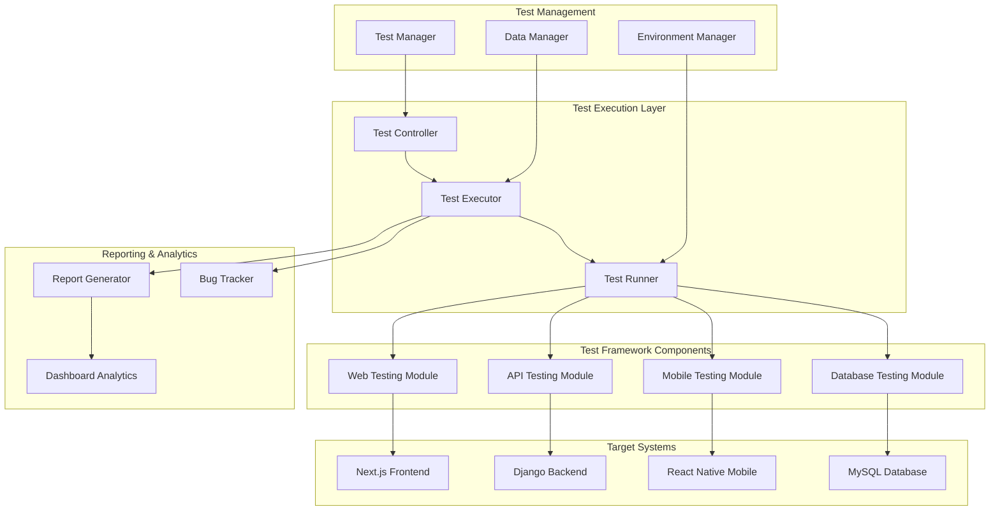

# QA Testing Framework Design Document

## Overview

The QA Testing Framework is designed as a comprehensive end-to-end testing solution for a multi-vendor e-commerce platform. The framework provides 100% coverage of user journeys across all system layers (Next.js frontend, Django REST API backend, React Native mobile app, and MySQL database) with automated test execution, detailed reporting, and continuous integration capabilities.

### Key Design Principles

- **Comprehensive Coverage**: Test all user roles, CRUD operations, and system integrations
- **Multi-Platform Support**: Web, mobile, and API testing in a unified framework
- **Scalable Architecture**: Support for parallel execution and multiple environments
- **Detailed Reporting**: Comprehensive bug tracking with severity classification
- **CI/CD Integration**: Seamless integration with development workflows

## Architecture

### High-Level Architecture



### Framework Architecture Layers

1. **Test Execution Layer**: Orchestrates test execution across different modules
2. **Test Framework Components**: Specialized testing modules for each platform
3. **Test Management**: Handles test data, environments, and execution coordination
4. **Reporting & Analytics**: Provides comprehensive reporting and issue tracking
5. **Target Systems**: The e-commerce platform components being tested

## Components and Interfaces

### Core Testing Modules

#### Web Testing Module (Selenium + Cypress)
- **Purpose**: Frontend UI testing for Next.js application
- **Technologies**: Selenium WebDriver, Cypress
- **Responsibilities**:
  - Cross-browser compatibility testing (Chrome, Firefox, Safari, Edge)
  - Responsive design validation
  - JavaScript functionality testing
  - Accessibility compliance verification
  - Performance testing (page load times)

#### Mobile Testing Module (Appium)
- **Purpose**: React Native mobile application testing
- **Technologies**: Appium, React Native Testing Library
- **Responsibilities**:
  - iOS and Android platform testing
  - Touch gesture validation
  - Push notification testing
  - Offline functionality testing
  - Performance monitoring (startup time, memory usage)

#### API Testing Module (REST Assured + Custom)
- **Purpose**: Django REST API endpoint testing
- **Technologies**: REST Assured, Postman/Newman, Custom Python scripts
- **Responsibilities**:
  - REST API endpoint validation
  - Authentication and authorization testing
  - Request/response format verification
  - Rate limiting and security testing
  - Performance and load testing

#### Database Testing Module (Custom)
- **Purpose**: MySQL database operations testing
- **Technologies**: mysql-connector-python, PyMySQL, SQLAlchemy, Custom Python scripts
- **Responsibilities**:
  - CRUD operations validation
  - Data integrity verification
  - Transaction handling testing
  - Backup/restore functionality
  - Query performance testing

### Test Management Components

#### Test Manager
- **Interface**: `ITestManager`
- **Methods**:
  - `executeTestSuite(suite_name, environment)`
  - `scheduleTests(schedule_config)`
  - `getTestResults(test_id)`
  - `generateReport(report_type, filters)`

#### Data Manager
- **Interface**: `IDataManager`
- **Methods**:
  - `setupTestData(environment)`
  - `cleanupTestData(test_id)`
  - `createTestUser(user_type)`
  - `generateTestProducts(category, count)`

#### Environment Manager
- **Interface**: `IEnvironmentManager`
- **Methods**:
  - `switchEnvironment(env_name)`
  - `validateEnvironment(env_config)`
  - `setupPaymentSandbox(gateway_type)`
  - `configureNotificationServices()`

### Reporting Components

#### Report Generator
- **Interface**: `IReportGenerator`
- **Methods**:
  - `generateExecutionReport(test_run_id)`
  - `createCoverageReport(module_filter)`
  - `exportReport(format, destination)`
  - `scheduledReporting(schedule_config)`

#### Bug Tracker
- **Interface**: `IBugTracker`
- **Methods**:
  - `logDefect(test_case, severity, details)`
  - `updateDefectStatus(defect_id, status)`
  - `categorizeIssue(defect_details)`
  - `generateDefectSummary(filters)`

## Data Models

### Test Case Model
```python
class TestCase:
    id: str
    name: str
    description: str
    module: TestModule
    priority: Priority
    user_role: UserRole
    test_steps: List[TestStep]
    expected_result: str
    prerequisites: List[str]
    tags: List[str]
    estimated_duration: int
```

### Test Execution Model
```python
class TestExecution:
    id: str
    test_case_id: str
    environment: Environment
    status: ExecutionStatus
    start_time: datetime
    end_time: datetime
    actual_result: str
    screenshots: List[str]
    logs: List[str]
    defects: List[Defect]
```

### Defect Model
```python
class Defect:
    id: str
    test_case_id: str
    severity: Severity  # Critical, Major, Minor
    status: DefectStatus  # Open, In Progress, Resolved, Closed
    title: str
    description: str
    reproduction_steps: List[str]
    environment: Environment
    browser_details: BrowserInfo
    screenshots: List[str]
    assigned_to: str
    created_date: datetime
    resolved_date: datetime
```

### Test Data Models
```python
class TestUser:
    id: str
    user_type: UserType  # Guest, Registered, Premium, Seller, Admin, SuperAdmin
    email: str
    password: str
    profile_data: dict
    addresses: List[Address]
    payment_methods: List[PaymentMethod]

class TestProduct:
    id: str
    name: str
    category: str
    price: float
    stock_quantity: int
    variants: List[ProductVariant]
    seller_id: str
    status: ProductStatus
```

## Error Handling

### Error Classification System

#### Critical Errors (Severity 1)
- System crashes or complete feature failures
- Security vulnerabilities
- Data corruption or loss
- Payment processing failures
- Authentication system failures

**Handling Strategy**: Immediate test execution halt, alert development team, create high-priority defect

#### Major Errors (Severity 2)
- Feature not working as expected
- API endpoint failures
- Database connection issues
- Integration failures between components

**Handling Strategy**: Continue test execution, log detailed error information, create medium-priority defect

#### Minor Errors (Severity 3)
- UI/cosmetic issues
- Performance degradation
- Non-critical validation errors
- Minor usability issues

**Handling Strategy**: Continue test execution, log issue for future resolution, create low-priority defect

### Error Recovery Mechanisms

1. **Retry Logic**: Automatic retry for transient failures (network timeouts, temporary service unavailability)
2. **Fallback Strategies**: Alternative test paths when primary flows fail
3. **State Recovery**: Ability to restore test environment to known good state
4. **Graceful Degradation**: Continue testing other modules when one module fails

### Logging and Monitoring

```python
class ErrorHandler:
    def handle_error(self, error: Exception, context: TestContext):
        # Log error details
        self.logger.error(f"Test failed: {error}", extra={
            'test_case': context.test_case_id,
            'environment': context.environment,
            'timestamp': datetime.now(),
            'stack_trace': traceback.format_exc()
        })
        
        # Capture screenshots for UI tests
        if context.test_type == TestType.UI:
            screenshot_path = self.capture_screenshot(context)
            context.add_artifact(screenshot_path)
        
        # Create defect record
        defect = self.create_defect(error, context)
        self.bug_tracker.log_defect(defect)
        
        # Determine continuation strategy
        if error.severity == Severity.CRITICAL:
            raise TestExecutionHaltException(error)
        else:
            return ContinueExecution()
```

## Testing Strategy

### Test Coverage Matrix

| User Journey | Web UI | Mobile | API | Database | Integration |
|--------------|--------|--------|-----|----------|-------------|
| Authentication | ✓ | ✓ | ✓ | ✓ | ✓ |
| Product Browsing | ✓ | ✓ | ✓ | ✓ | ✓ |
| Shopping Cart | ✓ | ✓ | ✓ | ✓ | ✓ |
| Checkout Process | ✓ | ✓ | ✓ | ✓ | ✓ |
| Payment Processing | ✓ | ✓ | ✓ | ✓ | ✓ |
| Order Management | ✓ | ✓ | ✓ | ✓ | ✓ |
| Returns/Refunds | ✓ | ✓ | ✓ | ✓ | ✓ |
| Admin Functions | ✓ | - | ✓ | ✓ | ✓ |
| Seller Management | ✓ | ✓ | ✓ | ✓ | ✓ |

### Test Execution Strategy

#### Sequential Testing (Critical Paths)
- User registration → Login → Purchase → Payment → Order completion
- Admin login → Product management → Order processing
- Seller onboarding → Product listing → Order fulfillment

#### Parallel Testing (Independent Modules)
- Product search and filtering
- Notification systems
- Analytics and reporting
- Inventory management
- Multi-language/currency features

### Environment Strategy

#### Development Environment (Docker-compose)
- **Purpose**: Early development testing and debugging
- **Configuration**: Local containers with test databases
- **Test Data**: Minimal dataset for basic functionality testing

#### Staging Environment (Production-like)
- **Purpose**: Pre-production validation and integration testing
- **Configuration**: Mirrors production setup with test payment gateways
- **Test Data**: Comprehensive dataset with 50+ users, 500+ products

#### Production Environment (Limited)
- **Purpose**: Smoke testing and monitoring
- **Configuration**: Live production system
- **Test Data**: Synthetic transactions with immediate rollback

## Test Data Management

### Test Data Categories

#### User Accounts (50+ accounts)
- **Guest Users**: 10 temporary accounts for guest checkout testing
- **Registered Customers**: 15 accounts with various profile completeness levels
- **Premium Customers**: 10 accounts with loyalty program benefits
- **Sellers/Vendors**: 10 accounts with different product catalogs
- **Admin Users**: 3 accounts with different permission levels
- **Super Admin**: 2 accounts with full system access

#### Product Catalog (500+ products)
- **Categories**: 20+ categories with subcategories
- **Product Types**: Physical, digital, subscription-based
- **Stock Levels**: In-stock, low-stock, out-of-stock, backorder
- **Pricing**: Various price ranges, discounted items, premium products
- **Variants**: Size, color, material variations

#### Order History
- **Order States**: Confirmed, processing, shipped, delivered, cancelled, returned
- **Payment Methods**: All supported payment types with test transactions
- **Shipping Options**: Standard, express, international shipping
- **Order Values**: Various order amounts to test different scenarios

### Data Management Strategy

```python
class TestDataManager:
    def setup_environment_data(self, environment: Environment):
        """Setup complete test data for specified environment"""
        self.create_user_accounts(environment)
        self.populate_product_catalog(environment)
        self.setup_payment_gateways(environment)
        self.configure_shipping_providers(environment)
        self.initialize_notification_services(environment)
    
    def cleanup_test_data(self, test_execution_id: str):
        """Clean up data created during test execution"""
        self.remove_test_orders(test_execution_id)
        self.reset_user_states(test_execution_id)
        self.clear_temporary_data(test_execution_id)
    
    def create_isolated_test_data(self, test_case: TestCase):
        """Create isolated data for specific test case"""
        return TestDataSet(
            users=self.create_test_users(test_case.required_users),
            products=self.create_test_products(test_case.required_products),
            orders=self.create_test_orders(test_case.required_orders)
        )
```

## Integration Testing Strategy

### Frontend-Backend Integration
- **Data Flow Validation**: Ensure form submissions reach backend correctly
- **Real-time Updates**: Verify WebSocket connections for live updates
- **Session Management**: Test authentication token handling
- **Error Propagation**: Validate error messages display correctly

### Backend-Database Integration
- **Transaction Integrity**: Test rollback scenarios and data consistency
- **Connection Pooling**: Validate database connection management
- **Query Performance**: Monitor and test database query optimization
- **Data Mapping**: Ensure ORM mappings work correctly

### Third-party Integrations
- **Payment Gateways**: Test all payment methods in sandbox environments
- **Shipping Providers**: Validate shipping cost calculations and tracking
- **Notification Services**: Test email, SMS, and push notification delivery
- **Analytics Services**: Verify data collection and reporting accuracy

## Performance Testing Strategy

### Load Testing Scenarios
- **Normal Load**: 100 concurrent users for 30 minutes
- **Peak Load**: 500 concurrent users for 15 minutes
- **Stress Testing**: Gradually increase load until system breaks
- **Spike Testing**: Sudden load increases to test auto-scaling

### Performance Metrics
- **Response Times**: API endpoints < 200ms, Page loads < 3 seconds
- **Throughput**: Minimum 1000 requests per second
- **Resource Usage**: CPU < 80%, Memory < 85%, Database connections < 90%
- **Error Rates**: < 0.1% for critical operations

## Security Testing Strategy

### Security Test Categories
- **Authentication Testing**: Brute force protection, session management
- **Authorization Testing**: Role-based access control, privilege escalation
- **Input Validation**: SQL injection, XSS, CSRF protection
- **Data Protection**: Encryption at rest and in transit
- **API Security**: Rate limiting, token validation, secure headers

### Vulnerability Assessment
- **OWASP Top 10**: Systematic testing against common vulnerabilities
- **Penetration Testing**: Simulated attacks on critical components
- **Security Scanning**: Automated vulnerability scanning tools
- **Compliance Validation**: GDPR, PCI DSS compliance verification

## Automation and CI/CD Integration

### Test Automation Framework
```python
class AutomationFramework:
    def __init__(self):
        self.web_driver = WebDriverManager()
        self.mobile_driver = AppiumManager()
        self.api_client = APITestClient()
        self.db_client = DatabaseTestClient()
    
    def execute_test_suite(self, suite_name: str, environment: str):
        """Execute complete test suite with parallel execution"""
        test_suite = self.load_test_suite(suite_name)
        
        # Parallel execution for independent tests
        parallel_tests = test_suite.get_parallel_tests()
        sequential_tests = test_suite.get_sequential_tests()
        
        # Execute parallel tests
        parallel_results = self.execute_parallel(parallel_tests, environment)
        
        # Execute sequential tests
        sequential_results = self.execute_sequential(sequential_tests, environment)
        
        # Combine and report results
        return self.generate_execution_report(parallel_results + sequential_results)
```

### CI/CD Pipeline Integration
- **Trigger Points**: Code commits, pull requests, scheduled runs
- **Test Stages**: Unit tests → Integration tests → E2E tests → Performance tests
- **Reporting**: Automatic report generation and distribution
- **Failure Handling**: Automatic rollback on critical test failures

### Test Execution Monitoring
- **Real-time Dashboards**: Live test execution status
- **Alert Systems**: Immediate notification of test failures
- **Trend Analysis**: Historical test performance and reliability metrics
- **Resource Monitoring**: Test environment health and performance

## Reporting and Analytics

### Report Types

#### Execution Reports
- **Test Summary**: Pass/fail statistics, execution time, coverage metrics
- **Detailed Results**: Individual test case results with screenshots and logs
- **Trend Analysis**: Historical performance and reliability trends
- **Environment Comparison**: Results across different environments

#### Defect Reports
- **Defect Summary**: Issues by severity, module, and status
- **Root Cause Analysis**: Common failure patterns and causes
- **Resolution Tracking**: Time to resolution and fix verification
- **Quality Metrics**: Defect density and escape rates

#### Coverage Reports
- **Functional Coverage**: User journey and feature coverage
- **Code Coverage**: Backend code coverage from API tests
- **Test Case Coverage**: Requirements traceability matrix
- **Platform Coverage**: Cross-browser and cross-device coverage

### Dashboard Analytics
```python
class AnalyticsDashboard:
    def generate_real_time_metrics(self):
        return {
            'active_test_executions': self.get_active_executions(),
            'pass_fail_ratio': self.calculate_pass_fail_ratio(),
            'environment_health': self.check_environment_status(),
            'defect_trends': self.analyze_defect_trends(),
            'coverage_metrics': self.calculate_coverage_metrics()
        }
    
    def create_executive_summary(self, time_period: str):
        """Generate high-level summary for stakeholders"""
        return ExecutiveSummary(
            total_tests_executed=self.count_tests(time_period),
            overall_pass_rate=self.calculate_pass_rate(time_period),
            critical_issues=self.get_critical_issues(time_period),
            quality_trend=self.analyze_quality_trend(time_period),
            recommendations=self.generate_recommendations()
        )
```

## Design Rationale

### Technology Choices

#### Multi-Tool Approach
**Rationale**: Different testing tools excel in different areas. Selenium provides robust cross-browser support, Cypress offers modern web testing capabilities, and Appium handles mobile testing effectively.

#### Modular Architecture
**Rationale**: Separating concerns allows for independent development, testing, and maintenance of different framework components. This also enables parallel development and easier troubleshooting.

#### Comprehensive Data Management
**Rationale**: Proper test data management is crucial for reliable test execution. Having dedicated data management components ensures test isolation and repeatability.

#### Detailed Error Handling
**Rationale**: Comprehensive error handling and classification enables better debugging and faster issue resolution. The severity-based approach helps prioritize fixes effectively.

### Scalability Considerations

#### Parallel Execution
**Rationale**: Parallel test execution significantly reduces overall test execution time, enabling faster feedback cycles in CI/CD pipelines.

#### Environment Isolation
**Rationale**: Supporting multiple environments allows for appropriate testing at different stages of development while preventing interference between test runs.

#### Modular Reporting
**Rationale**: Flexible reporting capabilities serve different stakeholder needs, from detailed technical reports for developers to high-level summaries for management.

This design provides a comprehensive foundation for testing the multi-vendor e-commerce platform while maintaining flexibility for future enhancements and scalability requirements.